# 🏛️ CATATAN ROMBAK TOTAL SISTEM — DARI ARSIP SPJ MENJADI SISTEM PENGELOLAAN BMD

> **Status dokumen**: RANCANGAN v3.0 — BELUM DIEKSEKUSI (catatan saja, belum ada perubahan kode)
> **Tanggal**: 6 Oktober 2026
> **Instansi target**: **Kecamatan Mekarmukti** (Kabupaten Garut — *perlu konfirmasi*)
> **Disusun oleh**: Jarvis untuk Mr Zeps
> **Repositori**: `asepsetiawan9/SIKEMAS` (folder kerja `pkp-mekarmukti`)

---

## 0. Daftar Isi

1. Ringkasan Eksekutif & Keputusan yang Sudah Diambil
2. Identitas Sistem Baru (Rekomendasi Nama)
3. Hasil Analisis Sistem Saat Ini (As-Is)
4. Temuan Teknis, Bug & Utang Teknis
5. Landasan Regulasi BMD
6. Ruang Lingkup Sistem Baru (In / Out)
7. Role & Hak Akses Baru
8. Arsitektur Data Baru
9. Alur Bisnis (Workflow)
10. Business Rules Baru
11. Halaman, Navigasi & UI
12. Laporan & Dokumen Cetak
13. Rencana Pembongkaran Modul SPJ (Daftar File Lengkap)
14. Rencana Rebranding (Nama & Instansi)
15. Strategi Migrasi Database & Data
16. Fase Eksekusi & Acceptance Criteria
17. Strategi Testing
18. Risiko & Mitigasi
19. Keputusan yang Masih Menunggu Mr Zeps
20. **Alur Sistem Baru — User Journey Detail per Role** *(BARU)*
21. **Fitur Wajib & Spesifikasi Teknis Detail** *(BARU)*
22. **Panduan UI/UX Modern — Design System, Responsiveness & Premium Aesthetics** *(BARU)*
23. **Roadmap & Urutan Pengerjaan Step-by-Step (Work Breakdown Structure & Action Plan)** *(BARU)*

---

## 1. Ringkasan Eksekutif & Keputusan yang Sudah Diambil

### 1.1 Perubahan Paradigma

| Aspek | Sebelumnya (SIMPEL KAN v2) | Sesudah (v3 — Sistem BMD) |
|---|---|---|
| Fokus utama | Arsip bukti belanja SPJ + verifikasi Sekmat → Camat | **Pengelolaan Barang Milik Daerah (BMD)** tingkat kecamatan |
| Entitas inti | Program → Kegiatan → Sub Kegiatan → Belanja → Bukti | **Aset/Barang** → Ruangan → Pemegang → Mutasi → Pemeliharaan → Inventarisasi → Penghapusan |
| Modul aset | Disembunyikan (hidden) | **Modul utama**, diperkuat & diselaraskan regulasi |
| Modul SPJ | Modul utama | **DIHAPUS TOTAL** (V1 & V2) |
| Instansi | Kecamatan Caringin (hardcode) | **Kecamatan Mekarmukti** (dinamis dari Pengaturan) |
| Nama | SIMPEL KAN / SIKEMAS | **Nama baru** (lihat Bagian 2) |

### 1.2 Keputusan Final dari Mr Zeps (6 Okt 2026)

| # | Keputusan | Konsekuensi |
|---|---|---|
| K-01 | **SPJ dihapus TOTAL** — SPJ V1 (Spj, Kegiatan lama, konsolidasi) **dan** seluruh modul V2 (Program, KegiatanRap, SubKegiatan, Belanja, DokumenBukti, Verifikasi) | ±80 file backend/frontend/test dihapus. Sistem menjadi murni BMD. |
| K-02 | **Fitur Pengelolaan BMD diaktifkan** dan menjadi inti sistem | Modul Aset lama di-refactor besar (bukan sekadar di-unhide). |
| K-03 | **Nama sistem diganti** | Rekomendasi di Bagian 2, menunggu pilihan final. |
| K-04 | **Instansi: Kecamatan Mekarmukti** | Semua hardcode "Caringin" diganti; identitas instansi diambil dari tabel `pengaturan`. |
| K-05 | **Semua catatan pengembangan & deploy lama dihapus** | Panduan VPS/isolasi/deploy akan diberikan ulang oleh Mr Zeps. |

> [!CAUTION]
> **Pelajaran dari rapat 28 Sep 2026**: sistem v1 dianggap *terlalu kompleks* sehingga dipivot. Rancangan BMD ini **WAJIB** menjaga prinsip yang sama: **simpel, cepat dipakai, fokus ke data aset yang rapi**. Fitur dibagi menjadi **MVP (wajib)** dan **Lanjutan (opsional)** — jangan bangun fitur Lanjutan sebelum MVP dipakai nyata.

---

## 2. Identitas Sistem Baru (Rekomendasi Nama)

Nama yang dihindari karena bentrok dengan aplikasi resmi pemerintah: **SIMDA BMD, SIMAK-BMN, SIMBADA, SIPD, E-BMD**.

| # | Nama | Kepanjangan | Alasan |
|---|---|---|---|
| ⭐ 1 | **SIMUKTI** | **S**istem **I**nformasi **M**anajemen Aset Kecamatan Meka**r**mu**kti** | Pendek, mudah diucap, identitas lokal "Mukti" kuat. **Rekomendasi utama.** |
| 2 | **ASMARA** | **As**et **M**ekarmukti **R**api & **A**kuntabel | Sangat mudah diingat, nilai jual tinggi saat sosialisasi ke staf. |
| 3 | **MEKAR ASET** | Manajemen Elektronik Kekayaan & Aset Rakyat | Brand langsung menyebut wilayah & fungsi. |
| 4 | **SI-BAMUK** | Sistem Informasi Barang Milik Daerah Mekarmukti | Formal, mirip nomenklatur dinas. |
| 5 | **MUKTI-BMD** | Manajemen Utuh Kekayaan & Inventaris BMD | Gabungan identitas lokal + istilah teknis BMD. |

**Yang harus ikut berubah saat nama diputuskan** (detail di Bagian 14):
- `APP_NAME`, `VITE_APP_NAME`, judul `<title>`, logo/brand di Sidebar, Login, GuestLayout, ApplicationLogo.
- Prefix artisan command `sikemas:*` → `{slug-baru}:*`.
- Email seed `*@sikemas.test` → `*@{slug}.test`.
- Nama file export (`Laporan_..._Caringin_*.xlsx`).
- (Opsional) nama repositori GitHub, nama folder VPS, subdomain.

---

## 3. Hasil Analisis Sistem Saat Ini (As-Is)

### 3.1 Tech Stack Aktual

| Komponen | Versi / Pilihan |
|---|---|
| Backend | Laravel **12** (PHP ^8.2, strict_types di mayoritas file) |
| Frontend | React 18 + Inertia.js v2 + Tailwind CSS v3 (JSX, **belum TypeScript**) |
| Database | SQLite (dev & produksi) — skema dirancang kompatibel MySQL |
| Auth & RBAC | Laravel Breeze + `spatie/laravel-permission` v6 **dan** kolom enum `users.role` (dua sumber kebenaran) |
| PDF | `barryvdh/laravel-dompdf` |
| Excel | `maatwebsite/excel` |
| QR | `endroid/qr-code` **dan** `simplesoftwareio/simple-qrcode` (duplikat) |
| Chart | `recharts` |
| Toast | `sonner` |
| Icon | `lucide-react` |

### 3.2 Pola Arsitektur
`Route → FormRequest → Controller → Service → Repository → Model (+ Observer, Policy, Enum)` — pola ini **dipertahankan** di sistem baru.

### 3.3 Inventaris Modul Saat Ini

| Modul | Generasi | Status di UI | Nasib di v3 |
|---|---|---|---|
| SPJ (Spj, konsolidasi, verifikasi) | V1 | Route aktif, tidak di sidebar | ❌ **HAPUS** |
| Kegiatan Anggaran (pagu, realisasi) | V1 | Route aktif, tidak di sidebar | ❌ **HAPUS** |
| Program → Kegiatan RAP → Sub Kegiatan | V2 | Aktif | ❌ **HAPUS** |
| Belanja + Dokumen Bukti | V2 | Aktif (modul utama) | ❌ **HAPUS** (pola multi-file di-reuse untuk dokumen aset) |
| Verifikasi Sekmat / Persetujuan Camat | V2 | Aktif | ❌ **HAPUS** (pola state machine di-reuse untuk Usulan Penghapusan) |
| Aset / BMD + QR + KIB/KIR | V1 | **Hidden** (route aktif) | ♻️ **REFACTOR BESAR → inti sistem** |
| Laporan (Keuangan + Rekap Aset) | V1 | Aktif | ♻️ **TULIS ULANG** (hanya laporan BMD) |
| Dashboard | V1/V2 | Aktif | ♻️ **TULIS ULANG** (dashboard BMD) |
| Notifikasi | V1 | Aktif | ✅ **PERTAHANKAN** (trigger diganti) |
| Profile, Auth | Breeze | Aktif | ✅ **PERTAHANKAN** |
| Log Aktivitas, Pengaturan | V1 | Backend | ✅ **PERTAHANKAN** (diperluas) |
| Backup Database (command) | V1 | Scheduler | ♻️ **ADAPTASI** (driver SQLite) |

### 3.4 Kondisi Modul Aset Saat Ini (Fondasi yang Akan Dibangun Ulang)

**Yang sudah ada & bisa diselamatkan:**
- Tabel `aset` (kode_barang, nama, tahun_perolehan, nilai, kondisi, lokasi, penanggung_jawab, merk_type, nomor_register, ukuran, bahan, cara_perolehan, tanggal_verifikasi_fisik, foto_path, qr_code_path).
- `AsetService`: generate QR (endroid), generate PDF KIB/KIR (DomPDF), upload foto, update kondisi/lokasi.
- `AsetObserver`: log perubahan kondisi/lokasi/kode/penanggung jawab + notifikasi rusak berat.
- `AsetRepository`: paginate + filter (search, kondisi, lokasi, tahun, overdue), statistik.
- Halaman React: `Aset/Index.jsx` (30KB), `Aset/Form.jsx` (27KB), `Aset/Detail.jsx` (31KB) — semuanya file raksasa, perlu dipecah.
- Template PDF: `pdf/kib.blade.php`, `pdf/kir.blade.php`, `pdf/rekap_aset.blade.php`, `exports/rekap_aset.blade.php`.
- Komponen: `KondisiBadge`, `QrDownloadButton`.

**Kelemahan konseptual (harus dikoreksi):**
1. **Klasifikasi KIB/KIR salah konsep** — kode lama menganggap *KIB = aset tetap golongan 01–05, KIR = barang habis pakai/golongan 06*. Yang benar: **KIB adalah kartu/daftar per golongan A–F**, sedangkan **KIR adalah daftar barang per RUANGAN** (barang apa saja yang ada di satu ruangan). Satu aset bisa muncul di KIB B *dan* di KIR Ruang Camat.
2. **Tabel `kib_kir` menyimpan 1 PDF per aset** — tidak tepat. KIB/KIR adalah **laporan agregat** (banyak aset), harus di-generate on-demand, bukan disimpan per aset.
3. **Format kode barang non-standar** — regex `02.06/0012/2024` tidak mengikuti kodefikasi Permendagri 108/2014.
4. **`lokasi` berupa teks bebas** — tidak bisa jadi dasar KIR. Harus ada master **Ruangan**.
5. **`penanggung_jawab` FK ke `users`** — pemegang barang tidak selalu punya akun sistem. Harus ada master **Pegawai**.
6. **Tidak ada atribut khusus per golongan** — tanah butuh luas/sertifikat, kendaraan butuh nopol/rangka/mesin/BPKB, gedung butuh luas lantai/konstruksi, dll.
7. **Tidak ada siklus hidup aset**: mutasi, pemeliharaan, inventarisasi (opname), usulan penghapusan, status "dihapus".

---

## 4. Temuan Teknis, Bug & Utang Teknis

| ID | Tingkat | Temuan | Lokasi | Rekomendasi |
|---|---|---|---|---|
| TD-01 | 🔴 Tinggi | **Write-on-GET**: `AsetController::show()` men-generate QR & PDF KIB/KIR saat halaman dibuka (side effect di request GET) | `AsetController.php` L128–137 | Pindahkan ke Service saat create/update, atau job queue. GET harus read-only. |
| TD-02 | 🔴 Tinggi | **Race condition kode barang**: `generateKodeBarang()` memakai `count() + 1` → duplikasi nomor jika 2 user input bersamaan / ada data terhapus | `AsetService.php` L86–92 | Tabel `nomor_urut` + `DB::transaction` + `lockForUpdate()`. |
| TD-03 | 🔴 Tinggi | **Route stream file ditempel di `SpjController`** — jika SPJ dihapus, foto aset ikut rusak | `routes/web.php` L42–45, `SpjController::streamStorageFile` | Buat `FileController` khusus + whitelist folder baru. |
| TD-04 | 🟠 Sedang | **Bug whitelist folder**: route mengizinkan `aset_foto`, tetapi file disimpan di `aset_fotos` → foto 404 jika symlink storage bermasalah | `web.php` L43 vs `AsetService.php` L208/244 | Samakan nama folder. |
| TD-05 | 🟠 Sedang | **Dokumen sensitif di disk `public`** — sertifikat tanah/BPKB nantinya tidak boleh bisa diakses publik via URL tebakan | `AsetService` (disk `public`) | Dokumen aset → disk `local` (private) + route download ber-Policy. Hanya foto & QR yang boleh publik. |
| TD-06 | 🟠 Sedang | **QR berisi ID numerik** (`/aset/{id}`) → mudah di-enumerate | `AsetService::generateQrCode` | Gunakan `qr_token` (UUID/ULID) → route `/a/{token}`. |
| TD-07 | 🟠 Sedang | **6+ query COUNT di setiap request** untuk sidebar badge (termasuk Spj/Belanja) | `HandleInertiaRequests.php` L61–80 | Ganti badge BMD, bungkus `fn () =>` (lazy) & hanya query sesuai role. |
| TD-08 | 🟠 Sedang | **Dua sumber kebenaran role**: kolom `users.role` (enum) + Spatie roles | `User.php`, `RolePermissionSeeder` | Tetapkan satu: **Spatie permission sebagai otorisasi**, kolom `role` hanya untuk label/routing — disinkronkan via Service saat user dibuat/diubah. |
| TD-09 | 🟡 Rendah | **Duplikasi library QR** (`endroid/qr-code` + `simplesoftwareio/simple-qrcode`) | `composer.json` | Pertahankan `endroid/qr-code` saja. |
| TD-10 | 🟡 Rendah | **File React raksasa** (Aset/Index 30KB, Detail 31KB, Form 27KB, Kegiatan 46KB, Program 38KB) — melanggar Single Responsibility | `resources/js/Pages/**` | Pecah ke Atoms/Molecules/Organisms. |
| TD-11 | 🟡 Rendah | **Tahun anggaran hardcode `2026`** di Sidebar | `Sidebar.jsx` L385/390 | Ambil dari shared props `pengaturan.tahun_aktif`. |
| TD-12 | 🟡 Rendah | **Hardcode "Caringin"** di ±38 file (PHP, JSX, Blade, seeder, test, export) | lihat Bagian 14 | Ambil dari `pengaturan`. |
| TD-13 | 🟡 Rendah | **Route register Breeze masih terdaftar** (dibalas 403) | `routes/auth.php` L15–18 | Hapus route & halaman `Register.jsx` sekalian. |
| TD-14 | 🟡 Rendah | **Halaman tak terpakai**: `Welcome.jsx` (28KB), `Pages/Dashboard.jsx` (Breeze) | `resources/js/Pages` | Hapus. |
| TD-15 | 🟡 Rendah | **`BackupDatabaseCommand` berbasis mysqldump**, padahal produksi pakai SQLite | `BackupDatabaseCommand.php` | Tambah strategi SQLite (`VACUUM INTO` / copy file saat lock) + backup folder storage dokumen aset. |
| TD-16 | 🟡 Rendah | **Belum TypeScript** — aturan Jarvis Pro mewajibkan strict types/no `any` | Frontend | Opsional: migrasi bertahap ke TSX saat halaman ditulis ulang (keputusan Mr Zeps, Bagian 19). |
| TD-17 | ℹ️ Info | `AsetController::destroy()` return `void` & selalu ditolak policy | `AsetController.php` L256 | Ganti dengan alur **Usulan Penghapusan** resmi; hapus route DELETE langsung. |

---

## 5. Landasan Regulasi BMD

> [!IMPORTANT]
> Rancangan ini mengacu pada regulasi nasional berikut. **Format final laporan (KIB/KIR/Buku Inventaris) dan masa manfaat aset WAJIB dikonfirmasi dengan BPKAD Kabupaten Garut**, karena setiap kabupaten memiliki Peraturan Bupati turunan.

| Regulasi | Relevansi |
|---|---|
| PP No. 27 Tahun 2014 jo. PP No. 28 Tahun 2020 — Pengelolaan Barang Milik Negara/Daerah | Payung hukum siklus BMD |
| Permendagri No. 19 Tahun 2016 (beserta perubahannya) — Pedoman Pengelolaan BMD | Siklus: perencanaan, pengadaan, penggunaan, pemanfaatan, pengamanan & pemeliharaan, penilaian, pemindahtanganan, pemusnahan, penghapusan, **penatausahaan** (pembukuan, inventarisasi, pelaporan). Format KIB A–F, KIR, Buku Inventaris. |
| Permendagri No. 108 Tahun 2014 — Kodefikasi & Klasifikasi Barang | Struktur kode barang bertingkat (Akun.Kelompok.Jenis.Objek.Rincian Objek.Sub Rincian Objek.Sub-sub Rincian Objek) |
| Perbup Garut terkait BMD & penyusutan | Masa manfaat, kebijakan kapitalisasi, format lokal |

### 5.1 Posisi Kecamatan dalam Pengelolaan BMD
- Kecamatan = **Perangkat Daerah / Pengguna Barang** (atau Kuasa Pengguna Barang).
- **Camat** = Pengguna Barang → persetujuan akhir & penanda tangan laporan.
- **Sekretaris Kecamatan** = Pejabat Penatausahaan Pengguna Barang → verifikasi.
- **Pengurus Barang Pengguna** (umumnya staf Subbag Umum) = operator harian.

### 5.2 Golongan KIB

| Kode | Golongan | Atribut Khas |
|---|---|---|
| **A** | Tanah | Luas (m²), alamat, status hak, nomor & tanggal sertifikat, penggunaan |
| **B** | Peralatan & Mesin | Merk/tipe, ukuran/CC, bahan, nomor pabrik, rangka, mesin, polisi, BPKB |
| **C** | Gedung & Bangunan | Kondisi bangunan, bertingkat/tidak, beton/tidak, luas lantai, alamat, status & nomor tanah |
| **D** | Jalan, Irigasi & Jaringan | Konstruksi, panjang, lebar, luas, lokasi, status tanah |
| **E** | Aset Tetap Lainnya | Buku/perpustakaan (judul, pencipta), barang kesenian, hewan/tumbuhan, ukuran |
| **F** | Konstruksi Dalam Pengerjaan | Bangunan, konstruksi, luas, tanggal mulai, status tanah, nilai kontrak |

---

## 6. Ruang Lingkup Sistem Baru

### 6.1 Modul MVP (WAJIB — Fase 1–4)

| # | Modul | Fungsi Inti |
|---|---|---|
| M-01 | **Master Data** | Kodefikasi barang (Permendagri 108), Ruangan, Pegawai/Pemegang, Satuan |
| M-02 | **Inventaris Aset (Registrasi)** | Input aset per golongan A–F dengan atribut khusus, nomor register otomatis, foto & dokumen pendukung |
| M-03 | **Label QR** | QR berbasis token, cetak label massal (lembar A4), scan → detail aset (wajib login) |
| M-04 | **Penempatan & Mutasi** | Tempatkan aset ke ruangan/pemegang, pindah ruangan, ganti pemegang, cetak **BAST** |
| M-05 | **Pemeliharaan** | Catat riwayat pemeliharaan/perbaikan + biaya + kondisi sebelum/sesudah (*hanya pencatatan, BUKAN SPJ*) |
| M-06 | **Inventarisasi (Stock Opname)** | Sesi opname, cek aset via scan QR / checklist per ruangan, hasil: ditemukan/tidak, kondisi aktual |
| M-07 | **Usulan Penghapusan** | Aset rusak berat/hilang → usulan → verifikasi Sekcam → persetujuan Camat → status `dihapus` |
| M-08 | **Laporan** | KIB A–F, KIR per ruangan, Buku Inventaris, Rekap per golongan, Mutasi, Hasil Opname, Usulan Penghapusan — PDF & Excel |
| M-09 | **Dashboard BMD** | Angka besar: total aset, nilai perolehan, per golongan, per kondisi, usulan pending, aset belum di-opname |
| M-10 | **Pengguna & Pengaturan** | Kelola user + role, identitas instansi (nama, kabupaten, alamat, kode lokasi, pejabat penanda tangan), tahun aktif |
| M-11 | **Audit Trail** | Riwayat lengkap per aset (siapa, kapan, apa, nilai sebelum → sesudah) |

### 6.2 Modul Lanjutan (OPSIONAL — hanya jika MVP sudah dipakai)

| # | Modul | Catatan |
|---|---|---|
| L-01 | Peminjaman Barang Internal | Pinjam pakai kendaraan/proyektor/laptop dengan tanggal kembali & reminder |
| L-02 | Laporan Kerusakan oleh Pemegang | Pegawai melapor kerusakan dari HP via scan QR |
| L-03 | Penyusutan | Metode garis lurus berdasar masa manfaat (perlu Perbup Garut) |
| L-04 | Import Excel Aset Massal | Migrasi dari data KIB Excel/SIMDA yang sudah ada di kecamatan |
| L-05 | Reminder Pajak Kendaraan / STNK | Notifikasi H-30 jatuh tempo |

### 6.3 Di Luar Lingkup (OUT)
- ❌ Semua hal terkait SPJ, belanja, bukti belanja, pagu, realisasi anggaran, RAP.
- ❌ Perencanaan kebutuhan (RKBMD) & pengadaan — ditangani SIPD/aplikasi kabupaten.
- ❌ Integrasi otomatis ke aplikasi BMD kabupaten (cukup ekspor Excel sesuai format).
- ❌ Barang persediaan/habis pakai (ATK dsb.) — bukan aset tetap. *(Bisa jadi modul terpisah di masa depan.)*

---

## 7. Role & Hak Akses Baru

### 7.1 Role Baru

| Role (enum) | Label | Jabatan Riil | Tugas |
|---|---|---|---|
| `super_admin` | Super Administrator | Tim IT | Akses penuh, kelola user & pengaturan |
| `pengurus_barang` | Pengurus Barang | Staf Subbag Umum | Input/ubah aset, mutasi, pemeliharaan, opname, buat usulan penghapusan, cetak label & laporan |
| `penatausaha` | Pejabat Penatausahaan | Sekretaris Kecamatan | Verifikasi usulan penghapusan, monitoring, cetak laporan |
| `camat` | Pengguna Barang | Camat | Persetujuan final penghapusan, dashboard eksekutif, laporan |
| `pemegang` *(opsional)* | Pemegang Barang | Kasi/Staf | Lihat aset yang dipegangnya, (Lanjutan: lapor kerusakan, pinjam) |

### 7.2 Mapping Role Lama → Baru

| Role Lama | Role Baru |
|---|---|
| `super_admin` | `super_admin` |
| `operator`, `staf_umum`, `staf_keuangan` | `pengurus_barang` |
| `sekmat` | `penatausaha` |
| `camat` | `camat` |
| `kasi` | `pemegang` (atau dinonaktifkan) |

### 7.3 Matriks Permission (Spatie)

| Permission | super_admin | pengurus_barang | penatausaha | camat | pemegang |
|---|:-:|:-:|:-:|:-:|:-:|
| `master.manage` (kode barang, ruangan, pegawai) | ✅ | ✅ | ❌ | ❌ | ❌ |
| `aset.view` | ✅ | ✅ | ✅ | ✅ | 🔸 milik sendiri |
| `aset.create` / `aset.update` | ✅ | ✅ | ❌ | ❌ | ❌ |
| `aset.dokumen.view-sensitive` (sertifikat, BPKB) | ✅ | ✅ | ✅ | ✅ | ❌ |
| `aset.label.print` | ✅ | ✅ | ❌ | ❌ | ❌ |
| `mutasi.manage` | ✅ | ✅ | ❌ | ❌ | ❌ |
| `pemeliharaan.manage` | ✅ | ✅ | ❌ | ❌ | ❌ |
| `opname.manage` | ✅ | ✅ | ❌ | ❌ | ❌ |
| `opname.view` | ✅ | ✅ | ✅ | ✅ | ❌ |
| `penghapusan.create` | ✅ | ✅ | ❌ | ❌ | ❌ |
| `penghapusan.verify` | ✅ | ❌ | ✅ | ❌ | ❌ |
| `penghapusan.approve` | ✅ | ❌ | ❌ | ✅ | ❌ |
| `laporan.view` / `laporan.export` | ✅ | ✅ | ✅ | ✅ | ❌ |
| `user.manage` / `pengaturan.manage` | ✅ | ❌ | ❌ | ❌ | ❌ |

---

## 8. Arsitektur Data Baru

### 8.1 Diagram Relasi

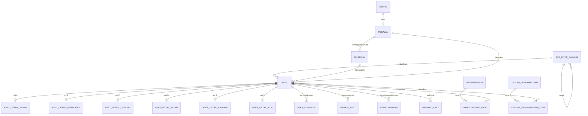

### 8.2 Tabel yang DIPERTAHANKAN (dengan penyesuaian)

| Tabel | Perubahan |
|---|---|
| `users` | Hapus kolom `seksi`; `role` pakai enum baru; tambah relasi ke `pegawai` |
| `permissions`, `roles`, dst. (Spatie) | Re-seed permission baru |
| `notifikasi` | Tetap; trigger diganti event BMD |
| `pengaturan` | Tambah key: `nama_instansi`, `kabupaten`, `provinsi`, `alamat_kantor`, `kode_lokasi`, `kode_upb`, `nama_camat`, `nip_camat`, `nama_sekcam`, `nip_sekcam`, `nama_pengurus_barang`, `nip_pengurus_barang`, `tahun_aktif`, `logo_path` |
| `log_aktivitas` | Tetap (log global sistem) |
| `cache`, `jobs`, `sessions` | Tetap |

### 8.3 Tabel BARU

#### `ref_kode_barang` — Kodefikasi Permendagri 108/2014
| Kolom | Tipe | Keterangan |
|---|---|---|
| id | bigint PK | |
| parent_id | FK self, nullable | Hierarki |
| kode | string, unique, index | Contoh `1.3.2.05.01.04.001` |
| uraian | string | Contoh `Lemari Kayu` |
| level | tinyint | 1–7 |
| golongan_kib | char(1), nullable, index | A–F (diwarisi dari level Jenis) |
| masa_manfaat | smallint, nullable | Tahun (untuk Lanjutan L-03) |
| is_selectable | boolean | Hanya level terbawah yang bisa dipilih saat input aset |

> Seed awal: subset kode yang lazim dipakai kecamatan (± 200–400 baris: tanah kantor, gedung kantor, kendaraan roda 2/4, meubelair, komputer, printer, AC, proyektor, genset, dll). Kode lengkap ditambah via import Excel.

#### `ruangan`
`id, kode (unique), nama, gedung (nullable), lantai (nullable), penanggung_jawab_id (FK pegawai, nullable), keterangan, is_active, timestamps`

#### `pegawai`
`id, nip (unique, nullable untuk non-ASN), nama, jabatan, unit_kerja, no_hp, user_id (FK users, nullable, unique), is_active, timestamps`

#### `aset` — DITULIS ULANG (tabel lama di-drop)
| Kolom | Tipe | Keterangan |
|---|---|---|
| id | bigint PK | |
| qr_token | ulid, unique | Isi QR → `/a/{qr_token}` |
| ref_kode_barang_id | FK | Klasifikasi |
| kode_barang | string, index | Denormalisasi kode untuk laporan cepat |
| nomor_register | string(6) | Urut per kode barang, contoh `000012` |
| golongan | char(1), index | A–F |
| nama | string | |
| merk_type | string, nullable | |
| spesifikasi | text, nullable | |
| tanggal_perolehan | date, index | |
| tahun_perolehan | smallint, index | |
| cara_perolehan | string (enum) | pembelian, hibah, sumbangan, produksi_sendiri, transfer_masuk, lainnya |
| sumber_dana | string (enum), nullable | APBD, APBN, DAK, Hibah, Lainnya |
| nilai_perolehan | decimal(15,2) | |
| satuan | string, default `unit` | |
| kondisi | string (enum), index | `baik`, `rusak_ringan`, `rusak_berat` |
| status | string (enum), index | `aktif`, `dipinjam`, `dalam_perbaikan`, `diusulkan_hapus`, `dihapus`, `hilang` |
| ruangan_id | FK ruangan, nullable, index | |
| pemegang_id | FK pegawai, nullable, index | |
| tanggal_verifikasi_fisik | date, nullable | Diisi otomatis dari opname |
| keterangan | text, nullable | |
| created_by / updated_by | FK users | |
| timestamps, softDeletes | | Soft delete hanya untuk koreksi salah input sebelum diverifikasi |

Index komposit: `UNIQUE(kode_barang, nomor_register)`, `(golongan, status)`, `(ruangan_id, status)`.

#### Tabel detail per golongan (relasi 1:1, kolom `aset_id` UNIQUE)
- `aset_detail_tanah`: luas_m2, alamat, status_hak, nomor_sertifikat, tanggal_sertifikat, penggunaan.
- `aset_detail_peralatan`: ukuran_cc, bahan, nomor_pabrik, nomor_rangka, nomor_mesin, nomor_polisi (index), nomor_bpkb, tanggal_pajak (Lanjutan L-05).
- `aset_detail_gedung`: kondisi_bangunan, bertingkat (bool), beton (bool), luas_lantai_m2, alamat, nomor_dokumen, tanggal_dokumen, luas_tanah_m2, status_tanah, kode_tanah.
- `aset_detail_jalan`: konstruksi, panjang_m, lebar_m, luas_m2, alamat, nomor_dokumen, status_tanah.
- `aset_detail_lainnya`: judul_pencipta, spesifikasi_buku, asal_daerah, pencipta, bahan, jenis_hewan_tumbuhan, ukuran.
- `aset_detail_kdp`: bangunan, bertingkat, beton, luas_m2, alamat, tanggal_mulai, status_tanah, nilai_kontrak.

> **Alternatif yang ditolak**: satu kolom JSON `atribut`. Ditolak karena nomor polisi/sertifikat perlu dicari & diindeks, dan laporan KIB butuh kolom bertipe jelas.

#### `aset_dokumen` (reuse pola `DokumenBukti`)
`id, aset_id, jenis (foto|sertifikat|bpkb|stnk|bast|faktur|kontrak|lainnya), nama_dokumen, disk (public|local), file_path, file_name, file_size, mime_type, nomor_dokumen (nullable), uploaded_by, timestamps`
- Foto → disk `public`. Dokumen legal (sertifikat/BPKB/STNK/kontrak) → disk `local` (private).

#### `mutasi_aset`
`id, nomor_bast (unique), aset_id, jenis (penempatan_awal|pindah_ruangan|ganti_pemegang|pengembalian), dari_ruangan_id, ke_ruangan_id, dari_pegawai_id, ke_pegawai_id, tanggal, alasan, dibuat_oleh, timestamps`

#### `pemeliharaan`
`id, aset_id, tanggal, jenis (rutin|perbaikan|penggantian_suku_cadang), uraian, biaya (decimal 15,2, nullable), pelaksana, kondisi_sebelum, kondisi_sesudah, dibuat_oleh, timestamps` (+ dokumen via `aset_dokumen` atau tabel lampiran sendiri)

#### `inventarisasi` & `inventarisasi_item`
- `inventarisasi`: `id, kode, nama (contoh "Opname Semester II 2026"), tanggal_mulai, tanggal_selesai, status (berjalan|selesai), ruangan_scope (nullable = semua), dibuat_oleh, timestamps`
- `inventarisasi_item`: `id, inventarisasi_id, aset_id, hasil (belum_dicek|ditemukan|tidak_ditemukan), kondisi_temuan, ruangan_temuan_id, catatan, diperiksa_oleh, diperiksa_pada` — `UNIQUE(inventarisasi_id, aset_id)`

#### `usulan_penghapusan` & `usulan_penghapusan_item`
- `usulan_penghapusan`: `id, nomor (unique), tanggal, alasan_umum, status, catatan_penatausaha, catatan_camat, diajukan_pada, diverifikasi_pada, disetujui_pada, dibuat_oleh, diverifikasi_oleh, disetujui_oleh, nomor_sk_penghapusan (nullable), tanggal_sk (nullable), timestamps`
- `usulan_penghapusan_item`: `id, usulan_id, aset_id, alasan (rusak_berat|hilang|usang|lainnya), keterangan` — `UNIQUE(usulan_id, aset_id)`

#### `riwayat_aset` (pengganti `riwayat_proses`)
`id, aset_id, aksi (enum), keterangan, data_sebelum (json, nullable), data_sesudah (json, nullable), referensi_type, referensi_id (mutasi/pemeliharaan/opname/usulan), user_id, created_at`

#### `nomor_urut` (anti race condition)
`id, kunci (unique, contoh "register:1.3.2.05.01.04.001" / "bast:2026" / "usulan:2026"), nilai_terakhir, updated_at`

### 8.4 Enum Baru (`app/Enums`)

| Enum | Nilai |
|---|---|
| `UserRole` | super_admin, pengurus_barang, penatausaha, camat, pemegang |
| `GolonganKib` | A, B, C, D, E, F (+ `label()`) |
| `KondisiAset` | baik, rusak_ringan, rusak_berat *(dipertahankan)* |
| `StatusAset` | aktif, dipinjam, dalam_perbaikan, diusulkan_hapus, dihapus, hilang |
| `CaraPerolehan` | pembelian, hibah, sumbangan, produksi_sendiri, transfer_masuk, lainnya *(diperluas)* |
| `SumberDana` | APBD, APBN, DAK, HIBAH, LAINNYA *(disesuaikan)* |
| `JenisDokumenAset` | foto, sertifikat, bpkb, stnk, bast, faktur, kontrak, lainnya |
| `JenisMutasi` | penempatan_awal, pindah_ruangan, ganti_pemegang, pengembalian |
| `JenisPemeliharaan` | rutin, perbaikan, penggantian_suku_cadang |
| `HasilInventarisasi` | belum_dicek, ditemukan, tidak_ditemukan |
| `StatusInventarisasi` | berjalan, selesai |
| `StatusUsulanPenghapusan` | draft, diajukan, diverifikasi, dikembalikan_penatausaha, disetujui, dikembalikan_camat, selesai |
| `AksiRiwayatAset` | registrasi, ubah_data, mutasi, pemeliharaan, opname, usul_hapus, dihapus, upload_dokumen, hapus_dokumen |
| `NotifikasiTipe` | info, warning, action *(dipertahankan)* |

---

## 9. Alur Bisnis (Workflow)

### 9.1 Registrasi Aset
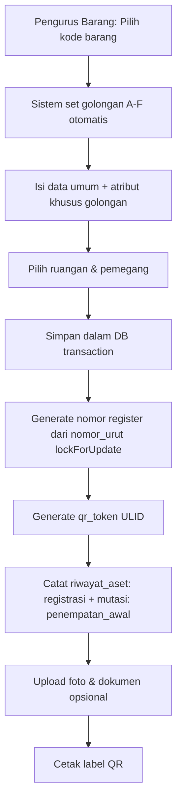

### 9.2 Mutasi / Pindah Ruangan
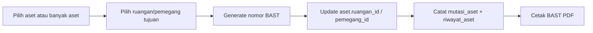
> Mutasi **tanpa approval** (agar simpel) — cukup tercatat & ada BAST bertanda tangan.

### 9.3 Inventarisasi (Stock Opname)
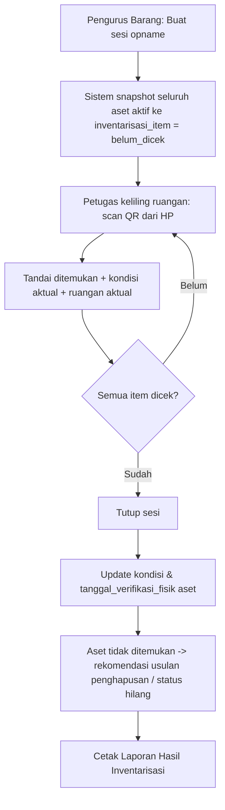

### 9.4 Usulan Penghapusan (satu-satunya alur dengan approval berjenjang)
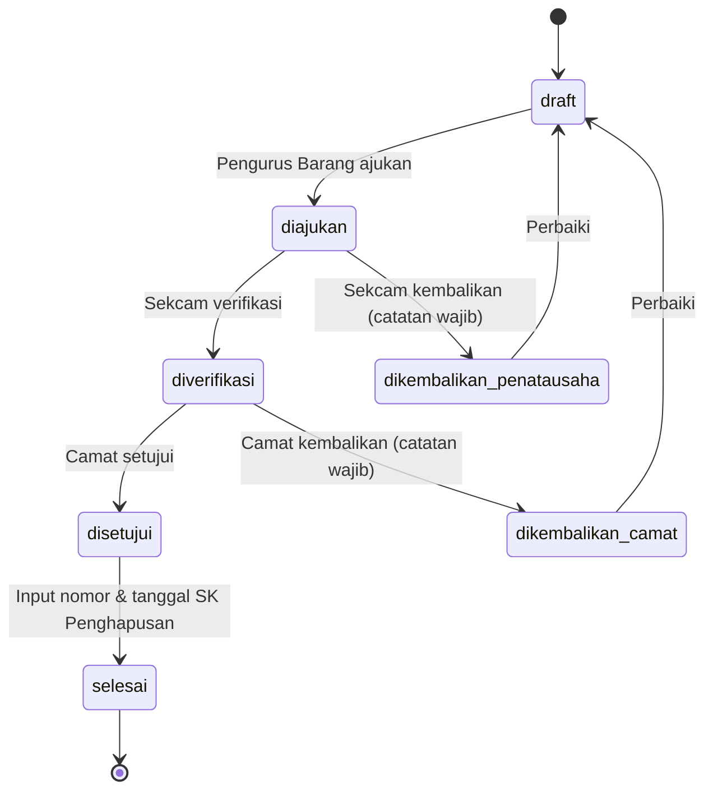
- Saat `diajukan` → status semua aset di dalamnya = `diusulkan_hapus` (terkunci dari mutasi).
- Saat dikembalikan → status aset kembali `aktif`.
- Saat `selesai` → status aset = `dihapus` (data tetap tersimpan, keluar dari KIB aktif, masuk daftar aset terhapus).

### 9.5 Pemeliharaan
Pengurus Barang mencatat → opsional set status aset `dalam_perbaikan` → saat selesai input kondisi sesudah → kondisi aset ter-update otomatis → riwayat tercatat.

---

## 10. Business Rules Baru

### BR-ASET (Registrasi & Data)
| ID | Aturan | Enforcement |
|---|---|---|
| BR-ASET-01 | Kode barang WAJIB dipilih dari `ref_kode_barang` level terbawah (`is_selectable = true`) | FormRequest `exists` + scope |
| BR-ASET-02 | Golongan ditentukan otomatis dari kode barang, tidak bisa diisi manual | Service |
| BR-ASET-03 | Nomor register = urut per kode barang, 6 digit, dibuat atomik (`nomor_urut` + `lockForUpdate`) | Service + transaction |
| BR-ASET-04 | Kombinasi `kode_barang + nomor_register` unik | DB unique index |
| BR-ASET-05 | Atribut detail WAJIB sesuai golongan (contoh: gol A wajib `luas_m2`; gol B kendaraan wajib `nomor_polisi`) | FormRequest kondisional per golongan |
| BR-ASET-06 | Aset berstatus `dihapus` / `diusulkan_hapus` bersifat **read-only** | Policy |
| BR-ASET-07 | Aset TIDAK BOLEH dihapus permanen. Soft delete hanya untuk koreksi salah input oleh super_admin dalam 24 jam setelah dibuat & belum ada riwayat mutasi | Policy + Service |
| BR-ASET-08 | Setiap perubahan data aset tercatat di `riwayat_aset` dengan nilai sebelum → sesudah | Observer |
| BR-ASET-09 | `qr_token` tidak pernah berubah meski kode barang berubah (label fisik tidak perlu dicetak ulang) | Model boot |
| BR-ASET-10 | Nilai perolehan ≥ 0; tanggal perolehan ≤ hari ini | FormRequest |

### BR-DOK (Dokumen Aset)
| ID | Aturan |
|---|---|
| BR-DOK-01 | Format: JPG/JPEG/PNG/WEBP (foto, maks 5MB, dikompres) & PDF (dokumen, maks 10MB). Validasi MIME server-side. |
| BR-DOK-02 | Dokumen legal (sertifikat, BPKB, STNK, kontrak) disimpan di disk **private**; diunduh via route ber-Policy. |
| BR-DOK-03 | Nama file di storage di-generate sistem (`{jenis}_{aset_id}_{ulid}.{ext}`), nama asli disimpan di DB. |
| BR-DOK-04 | Upload/hapus dokumen tercatat di `riwayat_aset`. |

### BR-MUT (Mutasi)
| ID | Aturan |
|---|---|
| BR-MUT-01 | Tujuan mutasi tidak boleh sama dengan lokasi/pemegang saat ini. |
| BR-MUT-02 | Aset berstatus `diusulkan_hapus`, `dihapus`, `hilang` tidak bisa dimutasi. |
| BR-MUT-03 | Nomor BAST otomatis: `BAST/{KODE_LOKASI}/{BULAN_ROMAWI}/{TAHUN}/{URUT_3}`. |
| BR-MUT-04 | Mutasi massal (banyak aset sekaligus) menghasilkan satu nomor BAST. |

### BR-OPN (Inventarisasi)
| ID | Aturan |
|---|---|
| BR-OPN-01 | Hanya boleh ada **satu** sesi opname berstatus `berjalan` dalam satu waktu. |
| BR-OPN-02 | Item opname di-snapshot saat sesi dibuat; aset baru setelahnya tidak otomatis masuk. |
| BR-OPN-03 | Saat sesi ditutup: kondisi & `tanggal_verifikasi_fisik` aset di-update dari hasil temuan. |
| BR-OPN-04 | Aset `tidak_ditemukan` ditandai di dashboard & laporan sebagai kandidat status `hilang`/penghapusan. |

### BR-HPS (Penghapusan)
| ID | Aturan |
|---|---|
| BR-HPS-01 | Hanya aset `rusak_berat` atau hasil opname `tidak_ditemukan` yang bisa diusulkan (kecuali alasan `lainnya` dengan keterangan wajib). |
| BR-HPS-02 | Satu aset hanya boleh ada di satu usulan aktif. |
| BR-HPS-03 | Catatan pengembalian (Sekcam/Camat) WAJIB min. 10 karakter. |
| BR-HPS-04 | Transisi status hanya sesuai state machine Bagian 9.4; pakai `lockForUpdate()` untuk cegah race condition. |
| BR-HPS-05 | Status `selesai` bersifat final & immutable; wajib nomor & tanggal SK. |

### BR-SYS (Sistem)
| ID | Aturan |
|---|---|
| BR-SYS-01 | Identitas instansi & pejabat penanda tangan diambil dari `pengaturan` — DILARANG hardcode. |
| BR-SYS-02 | Seluruh mutation dibungkus `DB::transaction()`. |
| BR-SYS-03 | Request GET tidak boleh menulis data/file (fix TD-01). |
| BR-SYS-04 | Semua query list memakai eager loading & pagination server-side (15/hal). |

---

## 11. Halaman, Navigasi & UI

### 11.1 Sidebar per Role

```
pengurus_barang / super_admin:
  📊 Dashboard
  📦 Inventaris Aset
     ├── Semua Aset
     ├── Tambah Aset
     └── Cetak Label QR
  🔁 Mutasi & BAST
  🛠️ Pemeliharaan
  📋 Inventarisasi (Opname)
  🗑️ Usulan Penghapusan            [badge: dikembalikan]
  📈 Laporan
  🗂️ Master Data
     ├── Kode Barang
     ├── Ruangan
     └── Pegawai
  ⚙️ Pengaturan & Pengguna          (super_admin saja)

penatausaha (Sekcam):
  📊 Dashboard
  ✅ Verifikasi Penghapusan         [badge: menunggu]
  📦 Inventaris Aset (read-only)
  📋 Hasil Inventarisasi
  📈 Laporan

camat:
  📊 Dashboard Eksekutif
  🛡️ Persetujuan Penghapusan        [badge: menunggu]
  📦 Inventaris Aset (read-only)
  📈 Laporan

pemegang (opsional):
  📦 Aset Saya
```

### 11.2 Daftar Halaman (Pages Inertia)

| Halaman | Path | Catatan |
|---|---|---|
| Dashboard | `/dashboard` | Angka besar + tabel kecil (bukan chart kompleks) |
| Aset Index | `/aset` | Tabs per golongan A–F + Semua; filter kondisi, status, ruangan, pemegang, tahun, pencarian (nama, kode, register, nopol, sertifikat) |
| Aset Create/Edit | `/aset/create`, `/aset/{id}/edit` | Form dinamis: field detail berubah sesuai golongan dari kode barang |
| Aset Detail | `/aset/{id}` | Info umum + atribut golongan + galeri foto + dokumen + riwayat (timeline) + mutasi + pemeliharaan + QR |
| Scan QR | `/a/{token}` | Redirect ke detail (setelah login, `intended()`) — **mobile-first** |
| Cetak Label | `/aset/label` | Pilih banyak aset / per ruangan → PDF lembar label A4 |
| Mutasi | `/mutasi`, `/mutasi/create` | Pilih aset (multi), tujuan, cetak BAST |
| Pemeliharaan | `/pemeliharaan` | List + form |
| Inventarisasi | `/inventarisasi`, `/inventarisasi/{id}` | Progress bar per ruangan, mode scan HP |
| Usulan Penghapusan | `/penghapusan`, `/penghapusan/{id}` | Draft → ajukan; antrean verifikasi/persetujuan |
| Laporan | `/laporan` | Pilih jenis laporan + filter → preview → PDF/Excel |
| Master Data | `/master/kode-barang`, `/master/ruangan`, `/master/pegawai` | CRUD + import Excel (kode barang) |
| Pengaturan | `/pengaturan`, `/pengguna` | Identitas instansi, pejabat, tahun aktif, logo; manajemen user |

### 11.3 Standar UI (dipertahankan + ditingkatkan)
- Design token HSL, font Inter, radius 8/12/16, soft shadow — sesuai sistem lama.
- **Warna brand baru** disesuaikan nama & logo Kecamatan Mekarmukti (menunggu logo resmi).
- **Mobile-first untuk halaman Scan QR & Inventarisasi** (petugas opname pakai HP).
- Wajib: Loading skeleton, Empty state, Toast (Sonner), ConfirmModal untuk aksi irreversible.
- File React dipecah: `Components/atoms`, `Components/molecules`, `Components/organisms` (contoh organism: `AsetDetailTanahFields`, `AsetDetailPeralatanFields`, …).

---

## 12. Laporan & Dokumen Cetak

| Kode | Laporan | Format | Filter |
|---|---|---|---|
| LAP-01 | **KIB A** Tanah | PDF (landscape F4/A4) + Excel | Tahun, kondisi, status |
| LAP-02 | **KIB B** Peralatan & Mesin | PDF + Excel | Tahun, kondisi, ruangan |
| LAP-03 | **KIB C** Gedung & Bangunan | PDF + Excel | |
| LAP-04 | **KIB D** Jalan, Irigasi & Jaringan | PDF + Excel | |
| LAP-05 | **KIB E** Aset Tetap Lainnya | PDF + Excel | |
| LAP-06 | **KIB F** Konstruksi Dalam Pengerjaan | PDF + Excel | |
| LAP-07 | **KIR** per Ruangan | PDF (ditempel di ruangan) + Excel | Ruangan |
| LAP-08 | **Buku Inventaris** & Rekap per Golongan | PDF + Excel | Tahun |
| LAP-09 | Laporan Mutasi Barang | PDF + Excel | Periode |
| LAP-10 | Laporan Hasil Inventarisasi | PDF + Excel | Sesi opname |
| LAP-11 | Daftar Usulan Penghapusan | PDF | Usulan |
| LAP-12 | Kartu Riwayat Aset (per aset) | PDF | Aset |
| DOC-01 | **BAST** Mutasi | PDF | Nomor BAST |
| DOC-02 | **Label QR** (lembar A4, mis. 3×8 label: logo, nama instansi, kode, register, nama barang, QR) | PDF | Aset/ruangan |

- Semua laporan memakai **kop & tanda tangan dinamis** dari `pengaturan` (Camat sebagai Pengguna Barang, Pengurus Barang, dan untuk KIR: penanggung jawab ruangan).
- Laporan besar (>1000 baris) → generate via **queue job** + notifikasi saat siap (cegah timeout).

---

## 13. Rencana Pembongkaran Modul SPJ (Daftar File Lengkap)

> Eksekusi dilakukan di **Fase 0** setelah Mr Zeps memberi instruksi. Sebelum menghapus, pola yang berguna (state machine, multi-file upload, riwayat) di-port dulu ke modul BMD.

### 13.1 Backend — ❌ HAPUS

| Kategori | File |
|---|---|
| Controllers | `SpjController`, `KegiatanController`, `ProgramController`, `BelanjaController`, `DokumenBuktiController`, `VerifikasiController` |
| Services | `SpjService`, `KegiatanService`, `ProgramService`, `BelanjaService`, `DokumenBuktiService` |
| Repositories | `SpjRepository`, `KegiatanRepository`, `ProgramRepository`, `BelanjaRepository`, `DokumenBuktiRepository` |
| Models | `Spj`, `Kegiatan`, `Program`, `KegiatanRap`, `SubKegiatan`, `Belanja`, `DokumenBukti`, `RiwayatProses`, `ArsipDigital` (tidak terpakai), `KibKir` (konsep salah, diganti laporan on-demand) |
| Policies | `SpjPolicy`, `KegiatanPolicy`, `ProgramPolicy`, `BelanjaPolicy` |
| Observers | `SpjObserver` |
| Requests | `StoreSpjRequest`, `VerifikasiSpjRequest`, `Kegiatan/StoreKegiatanRequest`, `Kegiatan/UpdateKegiatanRequest`, `StoreProgramRequest`, `StoreKegiatanRapRequest`, `StoreSubKegiatanRequest`, `StoreBelanjaRequest`, `UpdateBelanjaRequest`, `UploadDokumenRequest` |
| Enums | `SpjStatus`, `JenisBelanja`, `JenisDokumen`, `StatusDokumen`, `StatusVerifikasi`, `StatusKegiatan`, `SeksiType`, `JenisKibKir` |
| Exceptions | `SpjStatusTransitionException`, `PaguExceededException`, `PendingRejectedSpjException` → diganti `InvalidStatusTransitionException` generik |
| Exports | `LaporanKeuanganExport` |
| Views Blade | `exports/laporan_keuangan.blade.php`, `pdf/laporan_keuangan.blade.php` |
| Migrations | `create_kegiatan_table`, `create_spj_table`, `create_kib_kir_table`, `create_arsip_digital_table`, `update_kessos_to_kesra_in_users_table`, `create_program_table`, `create_kegiatan_rap_table`, `create_sub_kegiatan_table`, `create_belanja_table`, `create_dokumen_bukti_table`, `create_riwayat_proses_table`, `add_extra_fields_to_belanja_table` (lihat strategi Bagian 15) |
| Seeders | `KegiatanSeeder`, `BelanjaV2Seeder`, `AsetSeeder` (ditulis ulang) |
| Commands | `AuditSummaryCommand` (review — jika khusus SPJ, hapus) |
| Routes | Grup `spj.*`, `kegiatan.*`, `program.*`, `belanja.*`, `dokumen-bukti.*`, `verifikasi.*`; route `register` |
| Composer | `simplesoftwareio/simple-qrcode` (duplikat) |

### 13.2 Frontend — ❌ HAPUS

| Kategori | File |
|---|---|
| Pages | `Spj/*` (5 file), `Kegiatan/Index.jsx`, `Program/Index.jsx`, `Belanja/*` (4 file), `Verifikasi/*` (2 file), `Dashboard/KasiDashboard.jsx`, `Dashboard/StafSekmatDashboard.jsx`, `Dashboard/CamatDashboard.jsx`, `Dashboard.jsx` (Breeze), `Welcome.jsx`, `Auth/Register.jsx` |
| Components | `StatusBadge.jsx` (ditulis ulang untuk status aset/usulan) |
| NPM | `recharts` (jika dashboard final tanpa chart — keputusan Bagian 19) |

### 13.3 Tests — ❌ HAPUS / ♻️ TULIS ULANG

| File | Aksi |
|---|---|
| `Feature/Spj/SpjWorkflowTest.php` | ❌ Hapus |
| `Feature/Kegiatan/KegiatanWorkflowTest.php` | ❌ Hapus |
| `Feature/V2/*` (3 file) | ❌ Hapus |
| `Feature/UAT/UatScenarioTest.php` | ♻️ Tulis ulang (skenario BMD per role) |
| `Feature/Aset/AsetWorkflowTest.php` | ♻️ Tulis ulang |
| `Feature/Dashboard/DashboardWorkflowTest.php` | ♻️ Tulis ulang |
| `Feature/Laporan/LaporanWorkflowTest.php` | ♻️ Tulis ulang |
| `Feature/Authorization/RolePermissionPolicyTest.php` | ♻️ Tulis ulang |
| `Feature/Auth/RegistrationTest.php` | ♻️ Ubah: pastikan route register tidak ada |
| `Feature/Auth/*` lain, `ProfileTest.php` | ✅ Pertahankan |

### 13.4 ✅ PERTAHANKAN / ♻️ REFACTOR

| File | Aksi |
|---|---|
| `AsetController`, `AsetService`, `AsetRepository`, `AsetPolicy`, `AsetObserver`, `Aset` model, `Requests/Aset/*` | ♻️ Refactor besar sesuai Bagian 8–10 |
| `DashboardController` + `DashboardService` | ♻️ Tulis ulang (BMD) |
| `LaporanController` + `LaporanService` + `RekapAsetExport` | ♻️ Tulis ulang (LAP-01 s/d LAP-12) |
| `pdf/kib.blade.php`, `pdf/kir.blade.php`, `pdf/rekap_aset.blade.php`, `exports/rekap_aset.blade.php` | ♻️ Tulis ulang per golongan |
| `HandleInertiaRequests` | ♻️ Badge BMD + shared `pengaturan` (instansi, tahun) |
| `AppServiceProvider` | ♻️ Hapus observer SPJ, daftarkan observer BMD |
| `NotifikasiController/Service/Repository`, `Notifikasi` model | ✅ Pertahankan |
| `ProfileController`, Auth controllers (kecuali register) | ✅ Pertahankan |
| `CheckUserActive` middleware | ✅ Pertahankan |
| `LogAktivitas`, `Pengaturan`, `User` model | ♻️ Penyesuaian kecil |
| `BackupDatabaseCommand` | ♻️ Tambah dukungan SQLite + backup storage dokumen |
| `Sidebar`, `Topbar`, `AuthenticatedLayout`, `GuestLayout`, `ConfirmModal`, `EmptyState`, `LoadingSkeleton`, `KondisiBadge`, `QrDownloadButton`, `Modal`, `Dropdown`, form atoms | ✅/♻️ Pertahankan, sesuaikan brand & menu |
| `Utils/formatRupiah.js`, `Utils/formatDate.js`, `Hooks/usePermission.js` | ✅ Pertahankan |
| `deployment/*` (nginx.conf, deploy.sh, backup.sh, vps-nginx.conf) | ⏸️ Tunggu instruksi deploy baru dari Mr Zeps (masih berisi domain/folder lama) |
| `README.md` | ♻️ Ganti dari template Laravel ke README sistem baru |

---

## 14. Rencana Rebranding (Nama & Instansi)

### 14.1 File yang Mengandung Nama Lama (SIMPEL KAN / SIKEMAS)
`.env`, `.env.example`, `.env.production`, `resources/views/app.blade.php`, `Sidebar.jsx`, `Login.jsx`, `GuestLayout.jsx`, `ApplicationLogo.jsx`, `Dashboard/Index.jsx`, `Welcome.jsx`, `Kegiatan/Index.jsx`, `DashboardController.php`, `RegisteredUserController.php`, `BackupDatabaseCommand.php`, `AuditSummaryCommand.php`, `routes/console.php`, `UserSeeder.php`, `KegiatanSeeder.php`, `AsetSeeder.php`, `BelanjaV2Seeder.php`, migrasi `update_kessos_to_kesra`, tests (`V2/*`, `UAT`, `Dashboard`), `deployment/*`.

### 14.2 File yang Mengandung "Caringin"
`app.blade.php`, `Sidebar.jsx`, `Topbar.jsx`, `Login.jsx`, `GuestLayout.jsx`, `ApplicationLogo.jsx`, `Welcome.jsx`, `Dashboard/*.jsx`, `Laporan/Index.jsx`, `Aset/Index.jsx`, `Aset/Detail.jsx`, `Spj/Arsip.jsx`, `Kegiatan/Index.jsx`, `pdf/*.blade.php`, `exports/*.blade.php`, `AsetService.php`, `LaporanService.php`, `JenisBelanja.php`, `RekapAsetExport.php`, `LaporanKeuanganExport.php`, `UserSeeder.php`, `PengaturanSeeder.php`, `KegiatanSeeder.php`, `routes/console.php`, tests, `deployment/*`.

### 14.3 Aset Visual
- `public/logo.png` → **logo resmi Kecamatan Mekarmukti / Pemkab Garut** (menunggu file dari Mr Zeps).
- Favicon, warna primer sidebar (`#1a5b94`) → disesuaikan identitas baru.

### 14.4 Strategi
- Tambah helper/shared prop `instansi` (dari `pengaturan`) → seluruh UI & PDF membaca dari situ.
- `config('app.name')` dari `APP_NAME` untuk nama aplikasi.
- Tidak ada lagi string instansi di kode — hanya di seeder `PengaturanSeeder` sebagai nilai awal.

---

## 15. Strategi Migrasi Database & Data

### 15.1 Opsi

| Opsi | Penjelasan | Rekomendasi |
|---|---|---|
| **A. Fresh schema (squash)** | Hapus semua migrasi lama, buat set migrasi baru yang bersih untuk BMD, `migrate:fresh --seed` | ⭐ **Direkomendasikan** — sistem untuk instansi baru (Mekarmukti), tidak ada data produksi yang perlu dipertahankan |
| B. Migrasi incremental | Tambah migrasi `drop` tabel SPJ + `alter` aset | Hanya jika ada data produksi Mekarmukti yang harus dipertahankan |

### 15.2 Catatan Data Lama
- Data di server produksi lama (Caringin) **bukan milik Mekarmukti** → tidak dimigrasi.
- Jika kecamatan Mekarmukti sudah punya data KIB dalam Excel/SIMDA → gunakan fitur **Import Excel (L-04)** — sebaiknya dinaikkan prioritasnya ke MVP jika data aset sudah banyak (keputusan Bagian 19).

### 15.3 Urutan Migrasi Baru
1. users, cache, jobs, sessions (bawaan)
2. permission tables (Spatie)
3. pengaturan, notifikasi, log_aktivitas
4. pegawai
5. ref_kode_barang
6. ruangan
7. nomor_urut
8. aset
9. aset_detail_tanah … aset_detail_kdp
10. aset_dokumen
11. mutasi_aset, pemeliharaan
12. inventarisasi, inventarisasi_item
13. usulan_penghapusan, usulan_penghapusan_item
14. riwayat_aset

### 15.4 Seeder Baru
`RolePermissionSeeder` (baru), `PengaturanSeeder` (Mekarmukti), `UserSeeder` (5 akun per role), `PegawaiSeeder`, `RuanganSeeder` (Ruang Camat, Sekcam, Subbag Umum, Seksi-seksi, Aula, Pelayanan, Gudang, Garasi), `KodeBarangSeeder` (subset Permendagri 108), `AsetDemoSeeder` (hanya environment `local`, minimal 1 aset per golongan).

---

## 16. Fase Eksekusi & Acceptance Criteria

| Fase | Nama | Isi | Acceptance Criteria |
|---|---|---|---|
| **0** | Pembongkaran & Rebranding Dasar | Hapus semua file Bagian 13.1–13.3, fix TD-03/TD-04, ganti nama & instansi, squash migrasi | `php artisan test` hijau (test tersisa), `npm run build` sukses, tidak ada referensi `Spj`/`Belanja`/`Caringin` (cek `grep`), app bisa login |
| **1** | Fondasi Data BMD | Migrasi & model baru, enum, seeder, master data (Kode Barang, Ruangan, Pegawai) + CRUD | Semua tabel ter-migrate, relasi teruji, CRUD master data jalan per role |
| **2** | Inventaris Aset + QR | Registrasi per golongan A–F, nomor register atomik, dokumen (public/private), detail aset, riwayat, scan QR token, cetak label massal | Input 6 golongan sukses, nomor register tidak duplikat (uji paralel), dokumen private tidak bisa diakses tanpa login/izin, QR mengarah ke aset benar |
| **3** | Mutasi, Pemeliharaan, Inventarisasi | BAST, pemeliharaan, sesi opname mobile-first | BAST tercetak & nomor urut benar, opname mengupdate kondisi & tanggal verifikasi, hanya 1 sesi berjalan |
| **4** | Usulan Penghapusan | State machine + antrean Sekcam & Camat + notifikasi + badge | Semua transisi sesuai diagram, catatan wajib saat kembalikan, aset terkunci saat diusulkan, status final immutable |
| **5** | Laporan & Dashboard | LAP-01 s/d LAP-12, DOC-01/02, dashboard per role | Angka dashboard = data DB, PDF/Excel sesuai filter & format yang dikonfirmasi BPKAD |
| **6** | Hardening & UAT | Audit keamanan (Policy, IDOR, upload), performa (N+1, index), backup SQLite + storage, dokumentasi SOP baru | Lulus UAT per role, Lighthouse tinggi, backup & restore teruji |
| *(7)* | Lanjutan | L-01 s/d L-05 sesuai prioritas | Sesuai kebutuhan |

---

## 17. Strategi Testing

- **Feature test per modul**: Aset (per golongan), Master Data, Mutasi, Pemeliharaan, Inventarisasi, Penghapusan (setiap transisi + transisi ilegal), Laporan (PDF/Excel response 200 + header), Dashboard per role.
- **Authorization test**: matriks Bagian 7.3 diuji per permission (akses ditolak = 403).
- **Security test**: akses dokumen private tanpa izin (403), IDOR pada ID aset/dokumen, upload file berbahaya (MIME palsu), QR token acak (404).
- **Concurrency test**: generate nomor register & BAST secara berurutan cepat → tidak duplikat.
- **Regression**: pastikan tidak ada route/kelas SPJ yang tersisa (`php artisan route:list` + grep).

---

## 18. Risiko & Mitigasi

| Risiko | Dampak | Mitigasi |
|---|---|---|
| Sistem kembali terlalu kompleks (seperti v1) | Staf enggan pakai | Patuhi pembagian MVP vs Lanjutan; dashboard angka; form golongan dinamis yang hanya menampilkan field relevan |
| Format KIB/KIR tidak sesuai standar Garut | Laporan ditolak BPKAD | Konfirmasi template ke BPKAD **sebelum Fase 5**; template Blade modular |
| Data kodefikasi barang sangat besar | Seeder berat, dropdown lambat | Seed subset + import Excel; dropdown pakai search async (server-side) |
| Data aset awal masih manual/Excel | Input ulang memakan waktu | Naikkan prioritas Import Excel (L-04) |
| SQLite & penulisan bersamaan saat opname | Lock/timeout | Aktifkan WAL mode, transaksi singkat; siapkan opsi migrasi ke MySQL |
| Dokumen legal bocor | Pelanggaran keamanan | Disk private + Policy + log unduhan |
| Kehilangan data | Fatal | Backup harian DB + folder storage, uji restore bulanan |
| Penghapusan kode lama merusak fitur yang masih dipakai | Error 500 | Fase 0 dikerjakan dengan grep menyeluruh + test suite + build sebelum lanjut |

---

## 19. Keputusan yang Masih Menunggu Mr Zeps

| # | Pertanyaan | Opsi / Rekomendasi Jarvis |
|---|---|---|
| Q-01 | **Nama sistem final?** | ⭐ SIMUKTI / ASMARA / MEKAR ASET / SI-BAMUK / MUKTI-BMD / nama lain |
| Q-02 | Kabupaten benar **Garut**? Alamat kantor, kode lokasi/UPB, nama & NIP Camat, Sekcam, Pengurus Barang? | Dibutuhkan untuk `PengaturanSeeder` & kop laporan |
| Q-03 | Logo resmi untuk dipakai? | Kirim file PNG/SVG logo Kecamatan Mekarmukti / Pemkab Garut |
| Q-04 | Apakah role **`pemegang`** (Kasi/staf bisa login lihat aset sendiri) dibutuhkan di MVP? | Rekomendasi: **tidak** di MVP, aktifkan di Lanjutan |
| Q-05 | Apakah sudah ada **data KIB existing** (Excel/SIMDA)? Berapa perkiraan jumlah aset? | Jika ada → Import Excel masuk MVP |
| Q-06 | Template resmi KIB/KIR/BAST dari BPKAD Garut tersedia? | Jika ada, kirim contoh agar format PDF identik |
| Q-07 | Dashboard: angka saja, atau boleh 1–2 grafik sederhana? | Rekomendasi: angka + bar progress sederhana; `recharts` dihapus |
| Q-08 | Frontend tetap **JSX** atau migrasi ke **TypeScript (TSX)** saat penulisan ulang? | Rekomendasi: TSX untuk halaman baru (sesuai aturan strict type), bertahap |
| Q-09 | Database produksi tetap **SQLite** atau pindah **MySQL**? | SQLite cukup untuk skala kecamatan (WAL mode); MySQL jika multi-kecamatan di masa depan |
| Q-10 | Apakah perlu kolom `instansi_id` (siap multi-kecamatan)? | Rekomendasi: belum, cukup `pengaturan` — hindari kompleksitas |
| Q-11 | Instruksi **deployment & isolasi VPS** baru | Menunggu Mr Zeps (catatan lama sudah dihapus) |

---

## 20. Alur Sistem Baru — User Journey Detail per Role

> [!IMPORTANT]
> Setiap alur di bawah ini menggambarkan **pengalaman pengguna dari saat login hingga selesai tugas**. UI harus mengakomodasi tiap langkah dengan smooth transition, feedback jelas, dan navigasi intuitif.

### 20.1 Journey: Pengurus Barang — Registrasi Aset Baru

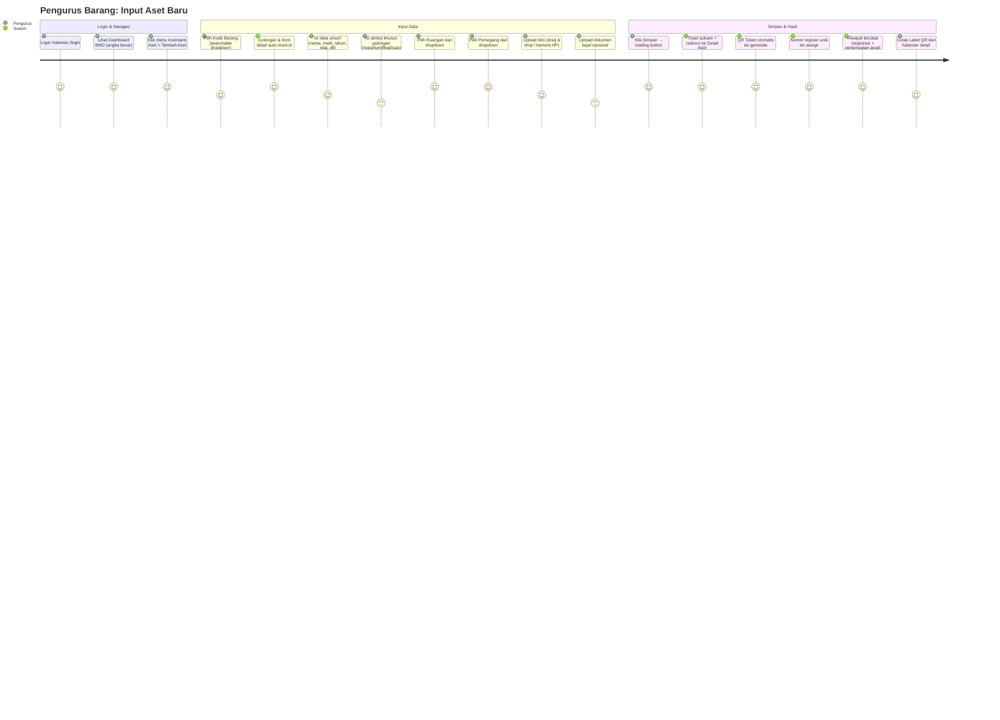

**Prinsip UX Journey ini:**
1. **Progressive Disclosure** — Form tidak menampilkan semua field sekaligus. Field detail golongan muncul setelah kode barang dipilih.
2. **Instant Feedback** — Saat kode barang dipilih, sistem langsung menampilkan golongan (A–F) dengan visual badge warna.
3. **Smart Defaults** — Tahun perolehan default = tahun aktif, satuan default = "unit", kondisi default = "baik".
4. **Error Prevention** — Validasi realtime (client-side) sebelum submit; duplikasi kode+register dicek.

### 20.2 Journey: Pengurus Barang — Mutasi Aset (Pindah Ruangan)

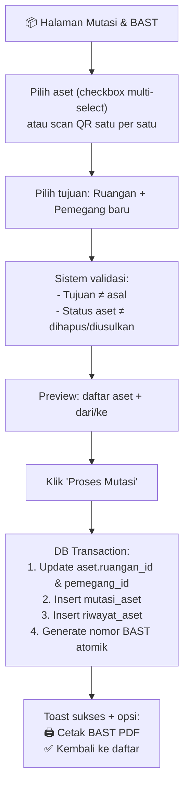

**UX Kritis:**
- **Multi-select dengan search** — Bisa pilih banyak aset sekaligus dengan search nama/kode.
- **Preview Step** — Sebelum proses, tampilkan ringkasan visual "dari → ke" dengan warna berbeda.
- **Print-ready** — BAST langsung bisa dicetak setelah mutasi, satu klik, PDF terbuka di tab baru.

### 20.3 Journey: Pengurus Barang — Stock Opname (Inventarisasi)

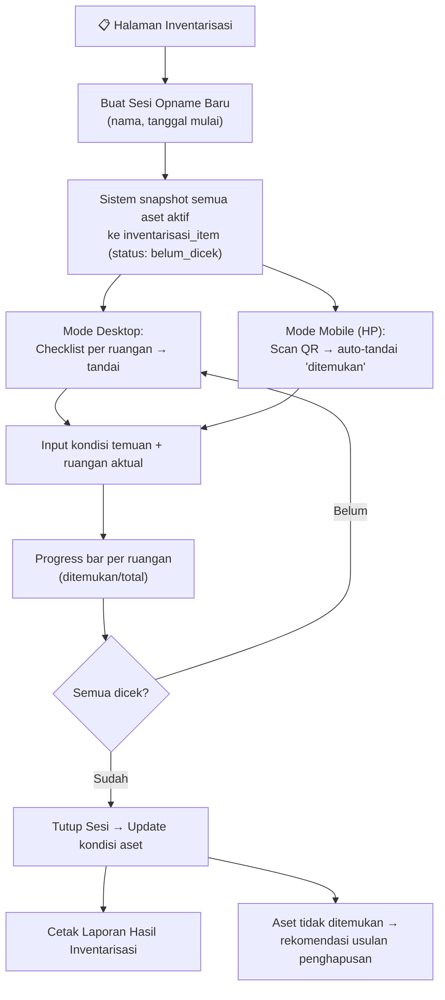

**UX Kritis:**
- **Mobile-First untuk Scan** — Halaman scan QR harus ringan, camera-native, dan one-tap mark.
- **Realtime Progress** — Progress bar per ruangan yang update saat rekan scan.
- **Offline Resilience** — Jika koneksi putus, data scan tersimpan di localStorage dan sync saat online.

### 20.4 Journey: Sekcam (Penatausaha) — Verifikasi Usulan Penghapusan

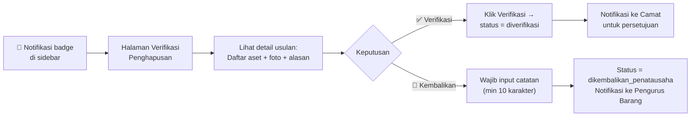

### 20.5 Journey: Camat — Dashboard Eksekutif + Persetujuan

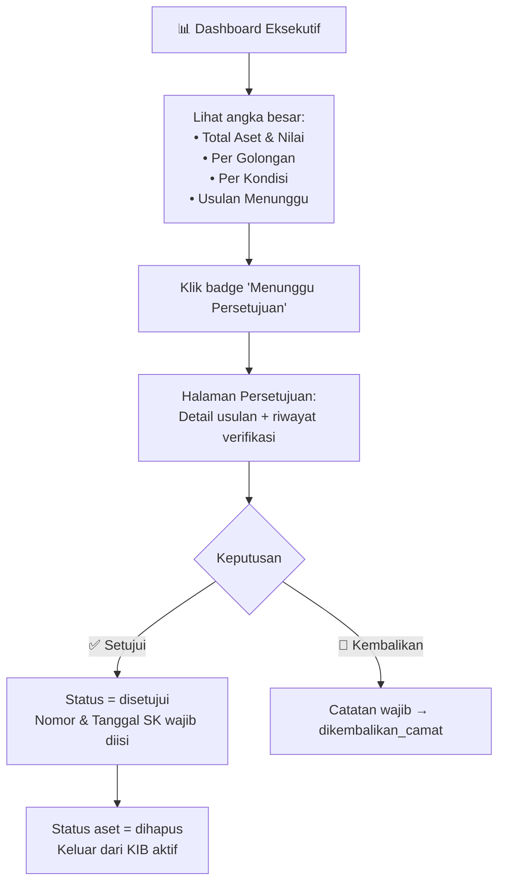

**UX Kritis:**
- **Dashboard Camat harus SIMPEL** — Hanya angka besar, tidak ada form input. Camat hanya melihat dan menyetujui.
- **One-click approval** — Proses setuju/tolak harus cepat dengan confirm modal.

### 20.6 Journey: Semua Role — Cetak Laporan

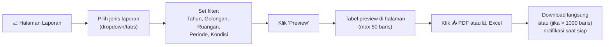

---

## 21. Fitur Wajib & Spesifikasi Teknis Detail

### 21.1 Fitur MVP — Harus Ada di Hari Peluncuran

#### F-01: Searchable Dropdown Kode Barang (Async Server-side)
| Aspek | Spesifikasi |
|---|---|
| **Komponen** | `<KodeBarangPicker />` — autocomplete async |
| **Behavior** | User mengetik min 2 karakter → query ke `/api/kode-barang?search={q}&is_selectable=true` → tampilkan max 20 hasil dalam dropdown |
| **Display per item** | `[kode] — [uraian]` + badge golongan (warna) |
| **Saat dipilih** | Set `ref_kode_barang_id`, `kode_barang`, `golongan` → trigger tampilkan form detail golongan |
| **Debounce** | 300ms |
| **Empty state** | "Tidak ditemukan. Hubungi admin untuk menambah kode barang." |

#### F-02: Form Aset Dinamis per Golongan
| Aspek | Spesifikasi |
|---|---|
| **Komponen** | `<AsetForm />` → memuat sub-form dinamis |
| **Sub-form** | `<DetailTanahFields />`, `<DetailPeralatanFields />`, `<DetailGedungFields />`, `<DetailJalanFields />`, `<DetailLainnyaFields />`, `<DetailKdpFields />` |
| **Trigger** | Golongan dari kode barang → `switch(golongan)` render sub-form yang relevan |
| **Animasi** | Sub-form muncul dengan `framer-motion` slide-down + fade-in (200ms, ease-out) |
| **Validasi** | Client-side realtime (border merah + pesan) + server-side FormRequest kondisional |

#### F-03: Multi-File Upload dengan Preview
| Aspek | Spesifikasi |
|---|---|
| **Komponen** | `<DokumenUploader />` — reuse pola DokumenBukti V2 |
| **Fitur** | Drag & drop area, klik browse, paste clipboard, capture kamera (mobile) |
| **Preview** | Thumbnail gambar, icon PDF untuk dokumen, progress bar per file |
| **Kategori** | Dropdown jenis dokumen (foto, sertifikat, BPKB, STNK, BAST, faktur, kontrak, lainnya) |
| **Limit** | Foto: max 5MB, JPG/PNG/WEBP. Dokumen: max 10MB, PDF. Max 10 file per aset. |
| **Feedback** | Toast error jika MIME tidak valid, file terlalu besar, atau kuota tercapai |

#### F-04: QR Code System (Token-Based)
| Aspek | Spesifikasi |
|---|---|
| **Generate** | Otomatis saat aset dibuat (ULID token) |
| **Isi QR** | URL `{APP_URL}/a/{qr_token}` |
| **Scan result** | Redirect ke halaman detail aset (login required, `intended()`) |
| **Cetak massal** | Halaman `/aset/label` — pilih aset (checkbox) atau pilih ruangan → generate PDF lembar label |
| **Layout label** | A4 landscape, 3 kolom × 8 baris = 24 label per lembar. Setiap label: QR (2cm×2cm), nama instansi, kode barang, nomor register, nama barang |
| **Komponen** | `<QrLabelPreview />` — preview interaktif di browser sebelum cetak |

#### F-05: Dashboard BMD Responsif
| Aspek | Spesifikasi |
|---|---|
| **Stat Cards** | 6 angka besar: Total Aset, Total Nilai (Rp), Baik, Rusak Ringan, Rusak Berat, Usulan Pending |
| **Ringkasan Golongan** | Horizontal bar chart / stacked bar — jumlah & nilai per A–F |
| **Action Cards** | Quick link sesuai role: "Tambah Aset", "Proses Mutasi", "Opname Berjalan", "Verifikasi Menunggu" |
| **Tabel Ringkas** | 5 aset terbaru + 5 mutasi terbaru |
| **Responsive** | Desktop: grid 3 kolom stat, 2 kolom tabel. Tablet: 2 kolom. Mobile: 1 kolom stack. |

#### F-06: Tabel Data dengan Filter Lanjutan
| Aspek | Spesifikasi |
|---|---|
| **Komponen** | `<DataTable />` — reusable, server-side pagination |
| **Fitur** | Search debounced, filter dropdown (golongan, kondisi, status, ruangan, tahun), sort per kolom, pagination 15/hal |
| **Bulk Actions** | Checkbox multi-select → "Cetak Label", "Mutasi Massal", "Ekspor Terpilih" |
| **Responsive** | Desktop: tabel penuh. Mobile: card-based layout (setiap row menjadi card) |
| **Empty State** | Ilustrasi SVG + teks "Belum ada data. [Tambah Aset Pertama →]" |
| **Loading** | Skeleton pulse sesuai layout tabel |

#### F-07: Timeline Riwayat Aset
| Aspek | Spesifikasi |
|---|---|
| **Komponen** | `<AssetTimeline />` — di halaman Detail Aset |
| **Data** | `riwayat_aset` — registrasi, ubah data, mutasi, pemeliharaan, opname, penghapusan, upload/hapus dokumen |
| **Layout** | Vertical timeline dengan dot warna per aksi, tanggal, user, dan deskripsi. Expand untuk lihat data sebelum/sesudah (JSON diff visual) |
| **Infinite scroll** | Load 20 item pertama, scroll bawah load more |

#### F-08: Halaman Detail Aset Premium
| Aspek | Spesifikasi |
|---|---|
| **Struktur** | Header card (nama, kode, badge golongan & kondisi & status, QR preview) → Tabs: Info Umum | Atribut Golongan | Dokumen & Foto | Riwayat | Mutasi | Pemeliharaan |
| **Galeri Foto** | Grid thumbnail, klik → lightbox fullscreen dengan swipe (mobile) |
| **Dokumen** | List dengan icon per jenis, klik → preview PDF in-browser atau download |
| **Quick Actions** | Floating action menu (FAB) di mobile: Edit, Mutasi, Catat Pemeliharaan, Cetak QR |

#### F-09: Master Data CRUD (Kode Barang, Ruangan, Pegawai)
| Aspek | Spesifikasi |
|---|---|
| **Kode Barang** | Tabel hierarchi (tree view collapsible), search, import Excel |
| **Ruangan** | CRUD + assign penanggung jawab, status aktif/nonaktif |
| **Pegawai** | CRUD, link ke user account (opsional), filter unit kerja |
| **UX** | Inline edit untuk field sederhana (nama, keterangan). Full form modal untuk data lengkap. |

#### F-10: Sistem Notifikasi In-App
| Aspek | Spesifikasi |
|---|---|
| **Trigger** | Aset rusak berat, usulan penghapusan baru, usulan diverifikasi/disetujui/dikembalikan, opname selesai, aset tidak ditemukan |
| **UI** | Bell icon di Topbar dengan badge count. Dropdown panel menampilkan 10 terbaru. Halaman `/notifikasi` untuk semua. |
| **Mark read** | Klik notifikasi → mark as read + navigate ke halaman terkait |
| **Tipe visual** | Info (biru), Warning (kuning), Action Required (merah pulsating dot) |

### 21.2 Fitur yang Harus Ada tapi Sering Terlupakan

| # | Fitur | Alasan | Komponen |
|---|---|---|---|
| FH-01 | **Breadcrumb navigasi** | User harus tahu posisinya di sistem | `<Breadcrumb items={[...]} />` |
| FH-02 | **Keyboard shortcuts** | Power user butuh kecepatan (Ctrl+K → command palette) | `<CommandPalette />` + `useHotkeys` |
| FH-03 | **Export filtered data** | Yang difilter di tabel harus bisa langsung diexport | Button "Ekspor Tampilan" di toolbar tabel |
| FH-04 | **Print-friendly CSS** | Laporan PDF harus bersih tanpa sidebar/topbar | `@media print` CSS + `print:hidden` utility |
| FH-05 | **Session timeout warning** | Alert 5 menit sebelum sesi habis agar data input tidak hilang | `<SessionTimeoutModal />` |
| FH-06 | **Unsaved changes guard** | Konfirmasi saat navigasi keluar dari form yang belum disimpan | `useBeforeUnload` + Inertia `onBefore` |
| FH-07 | **Audit log viewer** (admin) | Super admin bisa lihat log aktivitas semua user | Halaman `/log-aktivitas` + filter user/aksi/tanggal |
| FH-08 | **Pengaturan identitas instansi** | Camat/NIP/alamat/logo berubah tanpa deploy ulang | Halaman `/pengaturan` dengan form + preview kop surat |
| FH-09 | **Backup & Restore manual** | Super admin bisa trigger backup + download, dan restore dari file | `/pengaturan/backup` — satu klik |
| FH-10 | **Dark mode** (opsional tapi impactful) | Menambah kesan modern, nyaman di malam hari | Toggle di Topbar, simpan preference di localStorage |

---

## 22. Panduan UI/UX Modern — Design System, Responsiveness & Premium Aesthetics

> [!TIP]
> Bagian ini adalah panduan wajib untuk SEMUA halaman yang akan ditulis ulang. Setiap developer (termasuk Jarvis) harus merujuk bagian ini saat membuat komponen React baru.

### 22.1 Filosofi Desain

```
┌─────────────────────────────────────────────────────────┐
│  "Sistem pemerintah tidak harus terlihat kuno.          │
│   Buat staf kecamatan merasa bangga menggunakan         │
│   aplikasi yang terlihat secanggih aplikasi fintech."   │
└─────────────────────────────────────────────────────────┘
```

**Prinsip utama:**
1. **Clean & Spacious** — Whitespace adalah fitur, bukan kekosongan. Jangan pack content.
2. **Hierarchy Through Typography** — Ukuran font, weight, dan warna menentukan hierarki, bukan border atau background.
3. **Consistency Over Creativity** — Setiap halaman harus terasa "satu keluarga".
4. **Motion With Purpose** — Animasi hanya untuk memberi konteks (masuk/keluar, loading, success). Bukan hiasan.
5. **Mobile-First, Desktop-Enhanced** — Desain untuk layar kecil dulu, lalu tambahkan layout grid untuk desktop.

### 22.2 Design Tokens (Tailwind Config Baru)

```javascript
// tailwind.config.js — REKOMENDASI BARU
const tokens = {
  colors: {
    // Brand — sesuaikan setelah nama sistem diputuskan
    brand: {
      50:  'hsl(162, 63%, 95%)',   // Background sangat muda
      100: 'hsl(162, 60%, 90%)',   // Hover states
      200: 'hsl(162, 55%, 80%)',   // Border aktif
      300: 'hsl(162, 50%, 65%)',   // Icon sekunder
      400: 'hsl(162, 50%, 50%)',   // Text link
      500: 'hsl(162, 63%, 40%)',   // PRIMARY — Button, badge, active
      600: 'hsl(162, 65%, 33%)',   // Hover button
      700: 'hsl(162, 70%, 25%)',   // Pressed state
      800: 'hsl(162, 72%, 18%)',   // Sidebar bg dark mode
      900: 'hsl(162, 75%, 12%)',   // Text heading
    },
    // Alternatif: Jika ingin nuansa biru-teal kecamatan
    // brand: hsl(195, 65%, xx%) — Teal pemerintahan modern
    // Atau jika nama ASMARA dipilih — warm tone:
    // brand: hsl(340, 60%, xx%) — Rose-garnet

    // Semantic colors (tetap, sudah bagus)
    success: {
      DEFAULT: 'hsl(152, 69%, 40%)',
      light:   'hsl(152, 69%, 95%)',
      dark:    'hsl(152, 69%, 30%)',
    },
    warning: {
      DEFAULT: 'hsl(38, 92%, 50%)',
      light:   'hsl(38, 92%, 95%)',
      dark:    'hsl(38, 92%, 38%)',
    },
    danger: {
      DEFAULT: 'hsl(0, 72%, 51%)',
      light:   'hsl(0, 72%, 96%)',
      dark:    'hsl(0, 72%, 40%)',
    },
    info: {
      DEFAULT: 'hsl(210, 70%, 50%)',
      light:   'hsl(210, 70%, 95%)',
    },
    // Surface & Background
    surface: {
      DEFAULT: '#ffffff',
      raised:  'hsl(220, 14%, 99%)',  // Card yang sedikit naik
      sunken:  'hsl(220, 14%, 96%)',  // Background utama
      overlay: 'rgba(0, 0, 0, 0.5)',  // Modal backdrop
    },
    // Neutral (tuned warm-gray)
    neutral: {
      50:  'hsl(220, 14%, 98%)',
      100: 'hsl(220, 14%, 96%)',
      200: 'hsl(220, 14%, 90%)',
      300: 'hsl(220, 13%, 75%)',
      400: 'hsl(220, 13%, 60%)',
      500: 'hsl(220, 13%, 50%)',
      600: 'hsl(220, 13%, 40%)',
      700: 'hsl(220, 13%, 30%)',
      800: 'hsl(220, 13%, 20%)',
      900: 'hsl(220, 13%, 12%)',
    },
  },

  fontFamily: {
    sans: ['Inter Variable', 'Inter', 'system-ui', 'sans-serif'],
    mono: ['JetBrains Mono', 'Fira Code', 'monospace'],
  },

  fontSize: {
    // Modular scale 1.200 (Minor Third)
    'xs':   ['0.694rem', { lineHeight: '1rem' }],
    'sm':   ['0.833rem', { lineHeight: '1.25rem' }],
    'base': ['1rem',     { lineHeight: '1.5rem' }],
    'lg':   ['1.2rem',   { lineHeight: '1.75rem' }],
    'xl':   ['1.44rem',  { lineHeight: '2rem' }],
    '2xl':  ['1.728rem', { lineHeight: '2.25rem' }],
    '3xl':  ['2.074rem', { lineHeight: '2.5rem' }],
    '4xl':  ['2.488rem', { lineHeight: '3rem' }],
  },

  borderRadius: {
    'sm':    '6px',
    DEFAULT: '8px',
    'md':    '10px',
    'lg':    '12px',
    'xl':    '16px',
    '2xl':   '20px',
    '3xl':   '24px',
    'full':  '9999px',
    // Concentric radius rule: inner = outer - padding
    'card':  '16px',  // Card outer
    'card-inner': '12px', // Elemen di dalam card (button, image)
  },

  boxShadow: {
    'xs':  '0 1px 2px rgba(0, 0, 0, 0.04)',
    'sm':  '0 1px 3px rgba(0, 0, 0, 0.06), 0 1px 2px rgba(0, 0, 0, 0.04)',
    'md':  '0 4px 8px rgba(0, 0, 0, 0.06), 0 2px 4px rgba(0, 0, 0, 0.04)',
    'lg':  '0 10px 20px rgba(0, 0, 0, 0.08), 0 4px 8px rgba(0, 0, 0, 0.04)',
    'xl':  '0 20px 40px rgba(0, 0, 0, 0.1), 0 8px 16px rgba(0, 0, 0, 0.04)',
    'glow-brand': '0 0 20px hsla(162, 63%, 40%, 0.15)',
    'inner-soft': 'inset 0 2px 4px rgba(0, 0, 0, 0.04)',
  },

  spacing: {
    // 4px base grid
    'page-x': 'clamp(16px, 4vw, 32px)',
    'page-y': 'clamp(16px, 3vw, 24px)',
    'section-gap': 'clamp(24px, 5vw, 48px)',
    'card-padding': 'clamp(16px, 3vw, 24px)',
  },
};
```

### 22.3 Komponen Atom (Design System Foundation)

#### Buttons
```
┌────────────────────────────────────────────────┐
│ Button Variants                                │
├────────────────────────────────────────────────┤
│ Primary   │ bg-brand-500 text-white            │
│           │ hover:bg-brand-600                 │
│           │ active:bg-brand-700 scale-[0.98]   │
│           │ transition-all 150ms ease-out      │
│                                                │
│ Secondary │ bg-white border-neutral-200        │
│           │ text-neutral-700                   │
│           │ hover:bg-neutral-50 border-brand   │
│                                                │
│ Ghost     │ bg-transparent text-neutral-600    │
│           │ hover:bg-neutral-100               │
│                                                │
│ Danger    │ bg-danger text-white               │
│           │ hover:bg-danger-dark               │
│                                                │
│ Sizes     │ sm: h-8 px-3 text-xs rounded       │
│           │ md: h-10 px-4 text-sm rounded-md   │
│           │ lg: h-12 px-6 text-base rounded-lg │
│                                                │
│ States    │ Loading: spinner + "Menyimpan..."  │
│           │ Disabled: opacity-50 cursor-none   │
└────────────────────────────────────────────────┘
```

#### Badges & Status Indicators
```
┌───────────────────────────────────────────────────────┐
│ Badge System                                          │
├───────────────────────────────────────────────────────┤
│ Golongan:                                             │
│   A 🟤 bg-amber-100 text-amber-800    "Tanah"        │
│   B 🔵 bg-blue-100 text-blue-800      "Peralatan"    │
│   C 🟢 bg-emerald-100 text-emerald-800 "Gedung"      │
│   D 🟣 bg-violet-100 text-violet-800  "Jalan"        │
│   E 🟠 bg-orange-100 text-orange-800  "Lainnya"      │
│   F 🔴 bg-rose-100 text-rose-800      "KDP"          │
│                                                       │
│ Kondisi:                                              │
│   baik         → 🟢 dot + bg-emerald-50 text-emerald │
│   rusak_ringan → 🟡 dot + bg-amber-50 text-amber     │
│   rusak_berat  → 🔴 dot + bg-rose-50 text-rose       │
│                                                       │
│ Status Aset:                                          │
│   aktif          → bg-emerald-100 text-emerald-700    │
│   dipinjam       → bg-sky-100 text-sky-700            │
│   dalam_perbaikan→ bg-amber-100 text-amber-700        │
│   diusulkan_hapus→ bg-rose-100 text-rose-700 (pulse)  │
│   dihapus        → bg-neutral-200 text-neutral-500    │
│   hilang         → bg-neutral-800 text-white          │
│                                                       │
│ Status Usulan:                                        │
│   draft       → outline neutral                       │
│   diajukan    → bg-blue-100                           │
│   diverifikasi→ bg-emerald-100                        │
│   dikembalikan→ bg-amber-100 + pulse                  │
│   disetujui   → bg-emerald-500 text-white (solid)     │
│   selesai     → bg-neutral-800 text-white (final)     │
└───────────────────────────────────────────────────────┘
```

#### Cards
```
┌──────────────────────────────────────────────────────────┐
│ Card Variants                                            │
├──────────────────────────────────────────────────────────┤
│ Standard Card:                                           │
│   bg-white rounded-card shadow-sm border border-neutral- │
│   200/50 p-card-padding                                  │
│   hover:shadow-md transition-shadow 200ms                │
│                                                          │
│ Stat Card (Dashboard):                                   │
│   Same + gradient top border (4px brand-500)             │
│   Icon bg-brand-50 rounded-xl p-3                        │
│   Value: text-3xl font-bold text-neutral-900             │
│   Label: text-sm text-neutral-500                        │
│   Trend: ↑12% text-emerald-600 / ↓5% text-rose-600      │
│                                                          │
│ Action Card (Quick Link):                                │
│   bg-gradient-to-br from-brand-50 to-brand-100           │
│   hover:from-brand-100 hover:to-brand-200                │
│   Icon left, text right, arrow icon far-right             │
│   cursor-pointer group → icon scale on hover              │
│                                                          │
│ Glass Card (Hero/Banner):                                │
│   bg-gradient-to-r from-brand-800 via-brand-900          │
│   to-neutral-900 text-white                              │
│   backdrop-blur-xl bg-opacity-90                         │
│   Decorative: absolute circle blur-3xl opacity-10        │
└──────────────────────────────────────────────────────────┘
```

### 22.4 Layout System & Responsive Breakpoints

```
┌─────────────────────────────────────────────────────────────────┐
│ Responsive Layout Strategy                                      │
├──────────┬──────────────────────────────────────────────────────┤
│ < 640px  │ MOBILE — 1 kolom, card-based tables, bottom nav     │
│          │ Sidebar: hidden (hamburger di Topbar)                │
│          │ Tabel: → card layout (setiap row jadi card)          │
│          │ Form: full width, stacked fields                     │
│          │ Dashboard stats: 2 per row, scrollable               │
│          │ Detail aset: tabs menjadi scrollable horizontal      │
│          │ FAB (Floating Action Button) untuk aksi utama        │
│                                                                 │
│ 640–1024 │ TABLET — 2 kolom, sidebar auto-collapse              │
│          │ Sidebar: collapsed icon-only (72px)                  │
│          │ Tabel: horizontal scroll + sticky first col          │
│          │ Form: 2 kolom grid                                   │
│          │ Dashboard stats: 3 per row                           │
│                                                                 │
│ > 1024   │ DESKTOP — 3+ kolom, sidebar expanded                 │
│          │ Sidebar: expanded (260px) atau collapsed toggle      │
│          │ Tabel: full columns visible                          │
│          │ Form: 2-3 kolom grid, preview panel di samping       │
│          │ Detail aset: 2 kolom (info kiri, QR/foto kanan)      │
│          │ Dashboard stats: 4 per row                           │
│                                                                 │
│ > 1440   │ WIDE — content max-width 1360px, center              │
└──────────┴──────────────────────────────────────────────────────┘
```

**Responsive Table → Card Pattern:**
```jsx
// Mobile: card layout per row
<div className="block sm:hidden">
  {data.map(aset => (
    <div className="bg-white rounded-xl p-4 shadow-xs mb-3 border">
      <div className="flex items-start justify-between">
        <div>
          <span className="text-xs font-mono text-neutral-400">{aset.kode_barang}</span>
          <h3 className="font-semibold text-neutral-900 mt-0.5">{aset.nama}</h3>
        </div>
        <GolonganBadge golongan={aset.golongan} />
      </div>
      <div className="grid grid-cols-2 gap-2 mt-3 text-sm">
        <LabelValue label="Ruangan" value={aset.ruangan?.nama} />
        <LabelValue label="Kondisi" value={<KondisiBadge kondisi={aset.kondisi} />} />
        <LabelValue label="Nilai" value={formatRupiah(aset.nilai_perolehan)} />
        <LabelValue label="Tahun" value={aset.tahun_perolehan} />
      </div>
    </div>
  ))}
</div>

// Desktop: full table
<table className="hidden sm:table w-full">
  ...
</table>
```

### 22.5 Animasi & Micro-interactions

> Gunakan `framer-motion` (atau CSS transitions untuk yang sederhana). BUKAN animasi untuk pamer — setiap animasi harus punya TUJUAN.

| Interaksi | Animasi | Durasi | Easing | Tujuan |
|---|---|---|---|---|
| **Page enter** | Fade-in + translateY(8px → 0) | 200ms | ease-out | Orientasi: "halaman baru dimuat" |
| **Card hover** | Shadow sm → md + translateY(-1px) | 150ms | ease-out | Affordance: "ini bisa diklik" |
| **Button press** | Scale 0.98 | 100ms | ease-in-out | Feedback: "ditekan" |
| **Modal open** | Backdrop fade-in + content scale(0.95 → 1) + fade-in | 200ms | spring(0.5) | Konteks: "perhatian diperlukan" |
| **Modal close** | Reverse, sedikit lebih cepat | 150ms | ease-in | |
| **Toast appear** | Slide-in from right + fade-in | 300ms | spring | Notifikasi: "ada kabar baru" |
| **Tab switch** | Content slide-left/right + fade crossover | 200ms | ease-out | Navigasi: "pindah konteks" |
| **Form field error** | Shake horizontal (3px, 3 kali) + border merah | 300ms | ease-in-out | Error: "perlu diperbaiki" |
| **Badge pulse** | Scale 1 → 1.1 → 1, opacity 1 → 0.7 → 1 | 2000ms loop | ease-in-out | Urgensi: "ada yang menunggu" |
| **Skeleton loading** | Background gradient sweep (light → lighter → light) | 1500ms loop | linear | Loading: "data sedang dimuat" |
| **Success checkmark** | Circle draw + checkmark draw (SVG path) | 500ms | spring | Konfirmasi: "berhasil!" |
| **Dropdown open** | Max-height 0 → auto + fade-in | 200ms | ease-out | Expand: "opsi tersedia" |
| **List item enter** | Staggered fade-in + translateY (setiap item 30ms delay) | 200ms | ease-out | Progressive: "data dimuat per item" |
| **Delete item** | Slide-left + fade-out + height collapse | 300ms | ease-in | Removal: "item dihapus" |
| **Progress bar** | Width transition smooth | 500ms | ease-out | Progress: "ada kemajuan" |
| **Number counter** | Count-up animation (0 → target) | 800ms | ease-out | Impact: "angka ini penting" |

### 22.6 Sidebar Navigation — Redesign

```
┌─────────────────────────────────────┐
│ ┌───────────────────────────────┐   │
│ │  🏛️ [LOGO]                   │   │
│ │  SIMUKTI                     │   │  ← Brand area
│ │  Kec. Mekarmukti             │   │
│ └───────────────────────────────┘   │
│                                     │
│ ─── UTAMA ────────────────────────  │  ← Section label (muted)
│                                     │
│  📊  Dashboard                      │  ← Active: bg-brand-50
│                                     │     text-brand-700
│ ─── INVENTARIS ───────────────────  │     left border 3px brand-500
│                                     │
│  📦  Semua Aset                     │
│  ➕  Tambah Aset                    │
│  🏷️  Cetak Label QR                │
│                                     │
│ ─── PENGELOLAAN ──────────────────  │
│                                     │
│  🔁  Mutasi & BAST                  │
│  🛠️  Pemeliharaan                   │
│  📋  Inventarisasi            [🔵] │  ← Badge: sesi berjalan
│  🗑️  Usulan Penghapusan      [🔴2]│  ← Badge: dikembalikan
│                                     │
│ ─── PELAPORAN ────────────────────  │
│                                     │
│  📈  Laporan                        │
│                                     │
│ ─── PENGATURAN ───────────────────  │  ← super_admin only
│                                     │
│  🗂️  Master Data              ▸    │  ← Expandable submenu
│     ├─ Kode Barang                  │
│     ├─ Ruangan                      │
│     └─ Pegawai                      │
│  👥  Pengguna                       │
│  ⚙️  Pengaturan Instansi           │
│  📋  Log Aktivitas                  │
│                                     │
│ ─────────────────────────────────── │
│                                     │
│  👤  Asep Setiawan                  │  ← User card bottom
│      Pengurus Barang                │
│      [Profil] [Logout]              │
│                                     │
└─────────────────────────────────────┘

Collapsed Mode (72px):
┌──────┐
│ [🏛️] │  ← Logo only, tooltip on hover
│      │
│ [📊] │  ← Icon + tooltip "Dashboard"
│ [📦] │
│ [🔁] │
│ [🛠️] │
│ [📋] │
│ [🗑️] │ [🔴]  ← Badge still visible
│ [📈] │
│ [🗂️] │
│ [👥] │
│      │
│ [👤] │  ← Avatar only
└──────┘
```

**Transisi Collapse:**
- Width 260px → 72px: `transition-all 300ms cubic-bezier(0.4, 0, 0.2, 1)`
- Text: fade-out 150ms → hidden
- Logo text: fade-out, icon tetap
- Badge: tetap tampil, reposition ke atas icon

### 22.7 Login Page — Rekomendasi Desain

```
┌─────────────────────────────────────────────────────────────────┐
│                                                                 │
│         ┌──────────────────────────────────────────────┐        │
│         │                                              │        │
│  Left   │   ┌──────────────────────────────────┐      │  Right │
│  Panel  │   │         🏛️ LOGO                  │      │  Panel │
│  (hide  │   │       SIMUKTI                    │      │  (hero │
│   on    │   │   Kec. Mekarmukti, Kab. Garut    │      │  illu- │
│  mobile)│   │                                  │      │ stras- │
│         │   │  ┌────────────────────────────┐  │      │  tion, │
│  bg-    │   │  │ 📧 Email / NIP             │  │      │  grad- │
│  white  │   │  └────────────────────────────┘  │      │  ient  │
│         │   │  ┌────────────────────────────┐  │      │  bg)   │
│         │   │  │ 🔒 Password          👁️   │  │      │        │
│         │   │  └────────────────────────────┘  │      │  bg-   │
│         │   │                                  │      │ grad-  │
│         │   │  ☐ Ingat Saya                    │      │  ient  │
│         │   │                                  │      │ brand  │
│         │   │  ┌────────────────────────────┐  │      │  800   │
│         │   │  │      🔓 Masuk              │  │      │   →    │
│         │   │  └────────────────────────────┘  │      │ brand  │
│         │   │                                  │      │  500   │
│         │   │  Lupa password? Hubungi Admin     │      │        │
│         │   │                                  │      │ with   │
│         │   └──────────────────────────────────┘      │ float- │
│         │                                              │  ing   │
│         │  © 2026 Kec. Mekarmukti                      │ shapes │
│         │  Sistem Informasi Manajemen Aset             │ blur   │
│         └──────────────────────────────────────────────┘        │
│                                                                 │
└─────────────────────────────────────────────────────────────────┘

Mobile: Panel kanan hidden. Form centered full-width.
Background: subtle gradient brand-50 → white.
```

### 22.8 Halaman Aset Detail — Premium Layout

```
┌─────────────────────────────────────────────────────────────────────────┐
│ ← Kembali ke Inventaris                               [Edit] [⋮ More] │
├─────────────────────────────────────────────────────────────────────────┤
│                                                                         │
│  ┌────────────────────────────────────────────┐  ┌────────────────────┐ │
│  │  HEADER CARD                               │  │  QR CODE CARD      │ │
│  │  ┌──┐                                      │  │  ┌────────────┐   │ │
│  │  │B │ Printer Epson L3210                   │  │  │            │   │ │
│  │  └──┘ 1.3.2.05.01.04.001 / 000012          │  │  │   [QR]     │   │ │
│  │                                             │  │  │            │   │ │
│  │  🟢 Baik  |  ✅ Aktif  |  📅 2024          │  │  └────────────┘   │ │
│  │  💰 Rp 3.500.000                           │  │  Token: 01HX...   │ │
│  │  📍 Ruang Subbag Umum                       │  │  [🖨️ Cetak Label]│ │
│  │  👤 Ahmad Supriatna                         │  │  [📥 Download QR] │ │
│  └────────────────────────────────────────────┘  └────────────────────┘ │
│                                                                         │
│  ┌──────────────────────────────────────────────────────────────────┐   │
│  │  [Info Umum] [Detail Peralatan] [Dokumen 📎3] [Riwayat] [Mutasi]│   │
│  ├──────────────────────────────────────────────────────────────────┤   │
│  │                                                                  │   │
│  │  Tab Content Area                                                │   │
│  │                                                                  │   │
│  │  Untuk tab "Dokumen":                                            │   │
│  │  ┌─────────┐ ┌─────────┐ ┌─────────┐                           │   │
│  │  │ 📷      │ │ 📷      │ │ 📄      │  ← Grid galeri            │   │
│  │  │ Foto 1  │ │ Foto 2  │ │ BPKB.pdf│     Klik → lightbox       │   │
│  │  └─────────┘ └─────────┘ └─────────┘     atau preview           │   │
│  │                                                                  │   │
│  │  Untuk tab "Riwayat":                                            │   │
│  │  ● 6 Okt 2026 — Registrasi aset baru      ← Timeline vertical  │   │
│  │  │   oleh Ahmad Supriatna                                        │   │
│  │  ● 8 Okt 2026 — Mutasi ke Ruang Camat      ← dengan dot warna  │   │
│  │  │   BAST: BAST/MEK/X/2026/001                                   │   │
│  │  ● 15 Okt 2026 — Pemeliharaan rutin                              │   │
│  │     Biaya: Rp 150.000                                             │   │
│  │                                                                  │   │
│  └──────────────────────────────────────────────────────────────────┘   │
│                                                                         │
│  Mobile: FAB (Floating Action Button) di kanan bawah:                   │
│  [+] → Edit | Mutasi | Pemeliharaan | Cetak QR                         │
└─────────────────────────────────────────────────────────────────────────┘
```

### 22.9 Dashboard — Wireframe per Role

```
PENGURUS BARANG / SUPER ADMIN:
┌─────────────────────────────────────────────────────────────────┐
│  ┌─────────── WELCOME BANNER (Glass Card) ────────────────────┐ │
│  │  🏛️ SIMUKTI — Kec. Mekarmukti                              │ │
│  │  Selamat Datang, Ahmad Supriatna!                           │ │
│  │  [+ Tambah Aset]  [🔁 Proses Mutasi]  [📋 Mulai Opname]   │ │
│  └─────────────────────────────────────────────────────────────┘ │
│                                                                   │
│  ┌──────────┐ ┌──────────┐ ┌──────────┐ ┌──────────┐           │
│  │ 📦 247   │ │ 💰 1.2M  │ │ 🟢 231   │ │ 🔴 4     │           │
│  │ Total    │ │ Nilai    │ │ Baik     │ │ Rusak    │           │
│  │ Aset     │ │ Perolehan│ │          │ │ Berat    │           │
│  └──────────┘ └──────────┘ └──────────┘ └──────────┘           │
│                                                                   │
│  ┌──────────────────────────┐  ┌──────────────────────────────┐ │
│  │ Distribusi per Golongan  │  │ Aset Terbaru                 │ │
│  │ A ████░░░░░  23          │  │ ┌─ Printer Epson L3210       │ │
│  │ B ████████░  89          │  │ │  B · Baik · 6 Okt 2026    │ │
│  │ C ███░░░░░░  18          │  │ ├─ Meja Rapat Besar         │ │
│  │ D ██░░░░░░░   8          │  │ │  B · Baik · 5 Okt 2026    │ │
│  │ E █████░░░░  54          │  │ └─ ...                       │ │
│  │ F █░░░░░░░░   2          │  │    [Lihat Semua →]           │ │
│  └──────────────────────────┘  └──────────────────────────────┘ │
│                                                                   │
│  ┌──────────────────────────┐  ┌──────────────────────────────┐ │
│  │ 🚨 Perlu Perhatian       │  │ 📋 Mutasi Terakhir          │ │
│  │ • 4 aset rusak berat     │  │ BAST/MEK/X/2026/003         │ │
│  │ • 2 usulan dikembalikan  │  │ 3 aset → Ruang Camat        │ │
│  │ • 12 aset belum di-opname│  │ 6 Okt 2026                  │ │
│  │   [Detail →]             │  │ [Lihat Semua →]             │ │
│  └──────────────────────────┘  └──────────────────────────────┘ │
└─────────────────────────────────────────────────────────────────┘

CAMAT (EKSEKUTIF) — SUPER SIMPLE:
┌─────────────────────────────────────────────────────────────────┐
│  ┌─────────── WELCOME BANNER ─────────────────────────────────┐ │
│  │  Selamat Datang, Bapak Camat!                               │ │
│  │  Ringkasan Aset Kecamatan Mekarmukti                        │ │
│  │  [🛡️ Persetujuan Menunggu (2)]                              │ │
│  └─────────────────────────────────────────────────────────────┘ │
│                                                                   │
│  ┌───── ANGKA BESAR FULL WIDTH ──────────────────────────────┐  │
│  │  📦 247 Aset  │  💰 Rp 1.247.500.000  │  🟢 93.5% Baik  │  │
│  └───────────────────────────────────────────────────────────┘  │
│                                                                   │
│  ┌──────────────────────────┐  ┌──────────────────────────────┐ │
│  │ Nilai per Golongan       │  │ ⏳ Menunggu Persetujuan       │ │
│  │ (Donut chart / bar)      │  │ USL-001 · 4 aset · 3 Okt    │ │
│  │                          │  │ [Lihat & Setujui →]          │ │
│  └──────────────────────────┘  └──────────────────────────────┘ │
└─────────────────────────────────────────────────────────────────┘
```

### 22.10 Form Design Standards

```
FORM FIELD ANATOMY:
┌──────────────────────────────────────────┐
│  Label Nama Barang *                     │  ← Label: text-sm font-medium
│  ┌──────────────────────────────────┐    │     text-neutral-700
│  │  Placeholder text...             │    │     Asterisk: text-danger
│  └──────────────────────────────────┘    │
│  Helper: Masukkan nama sesuai KIB.       │  ← Helper: text-xs text-neutral-400
│                                          │
│  ERROR STATE:                            │
│  Label Nama Barang *                     │
│  ┌──────────────────────────────────┐    │  ← Border: ring-2 ring-danger/30
│  │  [input value]                    │    │     bg-danger-light
│  └──────────────────────────────────┘    │
│  ⚠️ Nama barang wajib diisi.            │  ← text-xs text-danger
└──────────────────────────────────────────┘

FORM LAYOUT RULES:
• Field yang saling terkait → satu baris (2 kolom): Merk & Type
• Field panjang (textarea/alamat) → full width
• Section dengan header: gunakan <fieldset> + legend styled
• Group fields dalam card rounded-xl dengan padding konsisten
• Submit button selalu di kanan bawah, sticky di mobile
• Tombol "Batal" selalu secondary/ghost, di kiri tombol utama

FORM SECTIONS (Aset Create/Edit):
┌─────────────────────────────────────────────────────┐
│  SECTION 1: Klasifikasi                              │
│  ┌─────────────────────────────────────────────────┐ │
│  │ Kode Barang *  [searchable dropdown]            │ │
│  │ Golongan       [auto-filled badge: B Peralatan] │ │
│  └─────────────────────────────────────────────────┘ │
│                                                       │
│  SECTION 2: Data Umum                                 │
│  ┌──────────────────┐ ┌──────────────────┐           │
│  │ Nama Barang *    │ │ Merk/Type        │           │
│  ├──────────────────┤ ├──────────────────┤           │
│  │ Tgl Perolehan *  │ │ Cara Perolehan * │           │
│  ├──────────────────┤ ├──────────────────┤           │
│  │ Nilai Perolehan *│ │ Sumber Dana      │           │
│  ├──────────────────┤ ├──────────────────┤           │
│  │ Satuan           │ │ Kondisi *        │           │
│  └──────────────────┘ └──────────────────┘           │
│                                                       │
│  SECTION 3: Detail Peralatan & Mesin  ← (dynamic)    │
│  ┌──────────────────┐ ┌──────────────────┐           │
│  │ Ukuran/CC        │ │ Bahan            │           │
│  ├──────────────────┤ ├──────────────────┤           │
│  │ No. Pabrik       │ │ No. Rangka       │           │
│  ├──────────────────┤ ├──────────────────┤           │
│  │ No. Mesin        │ │ No. Polisi       │           │
│  ├──────────────────┤ ├──────────────────┤           │
│  │ No. BPKB         │ │                  │           │
│  └──────────────────┘ └──────────────────┘           │
│                                                       │
│  SECTION 4: Penempatan                                │
│  ┌──────────────────┐ ┌──────────────────┐           │
│  │ Ruangan *        │ │ Pemegang Barang  │           │
│  └──────────────────┘ └──────────────────┘           │
│                                                       │
│  SECTION 5: Foto & Dokumen                            │
│  ┌─────────────────────────────────────────────────┐ │
│  │  ┌─┐  ┌─┐  ┌─────────────────────────────────┐ │ │
│  │  │📷│  │📷│  │ + Drag & Drop file di sini    │ │ │
│  │  └─┘  └─┘  │   atau klik untuk browse       │ │ │
│  │             └─────────────────────────────────┘ │ │
│  └─────────────────────────────────────────────────┘ │
│                                                       │
│  SECTION 6: Keterangan                                │
│  ┌─────────────────────────────────────────────────┐ │
│  │ [textarea full width]                            │ │
│  └─────────────────────────────────────────────────┘ │
│                                                       │
│                        [Batal]  [💾 Simpan Aset]      │
└─────────────────────────────────────────────────────┘
```

### 22.11 Empty States & Loading

**Prinsip:** Jangan pernah tampilkan halaman kosong tanpa konteks.

```
EMPTY STATE (Belum ada aset):
┌─────────────────────────────────────────────────────┐
│                                                       │
│              ┌────────────────────┐                   │
│              │   📦               │                   │
│              │   ~~~~             │  ← Ilustrasi SVG  │
│              │   ~~~ ~           │     minimalis      │
│              └────────────────────┘                   │
│                                                       │
│          Belum Ada Aset Terdaftar                      │
│                                                       │
│    Mulai dengan mendaftarkan aset pertama              │
│    Kecamatan Mekarmukti ke dalam sistem.               │
│                                                       │
│         [+ Daftarkan Aset Pertama]                     │
│                                                       │
└─────────────────────────────────────────────────────┘

LOADING SKELETON:
┌─────────────────────────────────────────────────────┐
│  ┌──────────┐ ┌──────────┐ ┌──────────┐            │
│  │ ░░░░░░░░ │ │ ░░░░░░░░ │ │ ░░░░░░░░ │  ← Stat   │
│  │ ░░░░░    │ │ ░░░░░    │ │ ░░░░░    │     cards  │
│  └──────────┘ └──────────┘ └──────────┘            │
│                                                      │
│  ░░░░░░░░░░░░░░░░░░░░░░░░░░░░░░░░░░░░  ← Table    │
│  ░░░░░░░░░░░░░░░░░░░░░░░░░░░░░░░░░░░░    rows     │
│  ░░░░░░░░░░░░░░░░░░░░░░░░░░░░░░░░░░░░    with     │
│  ░░░░░░░░░░░░░░░░░░░░░░░░░░░░░░░░░░░░    pulse    │
│  ░░░░░░░░░░░░░░░░░░░░░░░░░░░░░░░░░░░░    anim     │
└─────────────────────────────────────────────────────┘

SUCCESS ANIMATION (setelah simpan):
┌───────────────────────┐
│                       │
│       ✅              │  ← Animated SVG checkmark
│   Aset Berhasil       │     (circle draw + check draw)
│   Disimpan!           │
│                       │
│  Nomor Register:      │
│  000012               │
│                       │
│  [Lihat Detail]       │
│  [Tambah Lagi]        │
│                       │
└───────────────────────┘
```

### 22.12 Color Scheme per Nama Sistem (Opsi)

| Nama | Primary Hue | Mood | Palet Utama |
|---|---|---|---|
| **SIMUKTI** | `hsl(162, 63%, ...)` — Teal/Emerald | Profesional, modern, pemerintahan | Teal-500, Neutral-900, White |
| **ASMARA** | `hsl(340, 55%, ...)` — Rose/Garnet | Hangat, unik, memorable | Rose-600, Slate-800, Cream |
| **MEKAR ASET** | `hsl(142, 60%, ...)` — Green | Natural, pertumbuhan | Green-600, Stone-800, White |
| **SI-BAMUK** | `hsl(210, 65%, ...)` — Blue | Klasik pemerintahan, trust | Blue-600, Gray-900, White |
| **MUKTI-BMD** | `hsl(195, 65%, ...)` — Cyan/Teal | Modern, tech-forward | Cyan-600, Slate-900, White |

> ⭐ **Rekomendasi Jarvis**: **SIMUKTI** dengan palet **Teal/Emerald** — profesional tanpa terlihat generik, berbeda dari biru khas pemerintahan yang membosankan, dan warna hijau-teal mewakili "mekar" (growth/pertumbuhan) yang sesuai nama Mekarmukti.

### 22.13 Komponen Premium Tambahan yang Wajib Dibangun

| # | Komponen | Deskripsi | Prioritas |
|---|---|---|---|
| C-01 | `<Breadcrumb />` | Navigasi path dengan chevron separator | 🔴 Wajib |
| C-02 | `<DataTable />` | Server-side paginated table + search + filter + bulk action | 🔴 Wajib |
| C-03 | `<MobileCardList />` | Alternatif tabel untuk mobile (card per row) | 🔴 Wajib |
| C-04 | `<KodeBarangPicker />` | Async searchable dropdown kode barang | 🔴 Wajib |
| C-05 | `<GolonganBadge />` | Badge warna per golongan A–F | 🔴 Wajib |
| C-06 | `<StatusBadge />` | Badge warna per status aset/usulan | 🔴 Wajib (rewrite) |
| C-07 | `<KondisiBadge />` | Badge warna per kondisi aset | ✅ Ada (pertahankan) |
| C-08 | `<DokumenUploader />` | Multi-file upload drag & drop + preview + kategori | 🔴 Wajib |
| C-09 | `<DokumenGallery />` | Grid foto + lightbox + preview PDF | 🔴 Wajib |
| C-10 | `<AssetTimeline />` | Vertical timeline riwayat aset | 🔴 Wajib |
| C-11 | `<StatCard />` | Angka besar + label + icon + trend | 🔴 Wajib |
| C-12 | `<WelcomeBanner />` | Glass card hero banner per role | 🔴 Wajib |
| C-13 | `<ConfirmModal />` | Modal konfirmasi variant (danger, success, warning) | ✅ Ada (pertahankan) |
| C-14 | `<EmptyState />` | Ilustrasi + CTA saat data kosong | ✅ Ada (upgrade ilustrasi) |
| C-15 | `<LoadingSkeleton />` | Pulse skeleton per layout (table, card, detail) | ✅ Ada (tambah varian) |
| C-16 | `<FloatingActionButton />` | FAB untuk mobile (aksi utama quick access) | 🟡 Dibutuhkan |
| C-17 | `<SearchSelect />` | Generic async searchable dropdown (reusable) | 🔴 Wajib |
| C-18 | `<TabPanel />` | Tab component dengan animasi slide + badge count | 🔴 Wajib |
| C-19 | `<ProgressBar />` | Progress bar untuk opname (ditemukan/total) | 🟡 Dibutuhkan |
| C-20 | `<QrLabelPreview />` | Preview lembar label QR A4 di browser | 🟡 Dibutuhkan |
| C-21 | `<SessionTimeoutModal />` | Warning 5 min sebelum sesi expire | 🟡 Dibutuhkan |
| C-22 | `<UnsavedChangesGuard />` | Hook + modal saat navigasi keluar form | 🟡 Dibutuhkan |
| C-23 | `<NumberCounter />` | Animated count-up untuk stat card | 🟡 Nice-to-have |
| C-24 | `<CommandPalette />` | Ctrl+K search global (aset, ruangan, halaman) | 🟢 Nice-to-have |

### 22.14 Aksesibilitas & Performa Wajib

| Aspek | Standar | Implementasi |
|---|---|---|
| **Kontras Warna** | WCAG AA (4.5:1 teks, 3:1 icon) | Semua token warna harus lulus checker |
| **Focus Visible** | Ring 2px brand-400 offset 2px | Utility `focus-visible:ring-2 ring-brand-400 ring-offset-2` |
| **Keyboard Nav** | Semua interaksi bisa tanpa mouse | Tab order logis, Enter/Space untuk aksi, Escape untuk close |
| **Screen Reader** | Label ARIA untuk icon-only buttons | `aria-label`, `role`, `sr-only` text |
| **Touch Target** | Min 44×44px untuk mobile | Button min `h-10 w-10`, `p-3` untuk icon buttons |
| **LCP** | < 2.5 detik | Lazy load komponen berat, optimasi gambar, `loading="lazy"` |
| **CLS** | < 0.1 | Skeleton dengan dimensi tetap, image aspect-ratio |
| **Bundle Size** | < 300KB gzipped (JS initial) | Code splitting per route (Inertia lazy), tree-shake icons |
| **Font Loading** | No FOUT | `font-display: swap` + preload Inter Variable woff2 |

### 22.15 NPM Dependencies Baru yang Direkomendasikan

| Package | Fungsi | Ukuran | Wajib? |
|---|---|---|---|
| `framer-motion` | Animasi page transition, modal, list stagger | ~33KB gzip | ⭐ Sangat direkomendasikan |
| `@headlessui/react` | Dropdown, Modal, Tab, Dialog (accessible) | ~12KB | ✅ Sudah ada |
| `lucide-react` | Icon library (tree-shakeable) | ~2KB per icon | ✅ Sudah ada |
| `sonner` | Toast notification | ~5KB | ✅ Sudah ada |
| `react-dropzone` | Drag & drop file upload | ~8KB | ⭐ Direkomendasikan |
| `yet-another-react-lightbox` | Galeri foto fullscreen | ~15KB | ⭐ Direkomendasikan |
| `react-hot-keys` | Keyboard shortcut hook | ~3KB | 🟡 Opsional |
| `nuqs` | URL search params state sync | ~4KB | 🟡 Opsional (filter tabel) |
| ~~`recharts`~~ | ~~Chart library~~ | ~~60KB~~ | ❌ Hapus (ganti bar CSS manual atau `chart.js` yg lebih ringan jika butuh) |

---

## 23. Roadmap & Urutan Pengerjaan Step-by-Step (Work Breakdown Structure & Action Plan)

Bagian ini adalah **panduan eksekusi kronologis** yang memecah seluruh rencana rombak sistem menjadi langkah-langkah atomik, terukur, dan memiliki kriteria penerimaan (*gate criteria*) yang jelas. Tidak boleh melompat ke tahap berikutnya sebelum tahapan saat ini lulus verifikasi.

### 23.1 Prinsip & Aturan Main Eksekusi

1. **Safety First**: Sebelum menghapus atau mengubah satu baris kode pun, buat checkpoint git yang aman.
2. **Deconstruction First, Construction Later**: Modul SPJ lama dibongkar tuntas terlebih dahulu agar tidak meninggalkan *dead code*, dependensi usang, atau route hantu.
3. **Database-Driven Foundation**: Skema database, integritas relasi, foreign key cascade, dan enumerasi data diselesaikan sebelum UI disentuh.
4. **Atomic & Independent Verification**: Setiap step wajib diuji secara lokal (`php artisan test`, `npm run build`, verifikasi route).
5. **Clean Architecture (Laravel)**: Wajib pola **Controller → Service → Repository → Model**. Tidak ada business logic di Controller ataupun View.
6. **No Half-Baked Code**: Mengikuti protokol Jarvis Pro Mode, seluruh kode yang dihasilkan harus lengkap dan siap produksi.

---

### 23.2 Master Dependency Graph

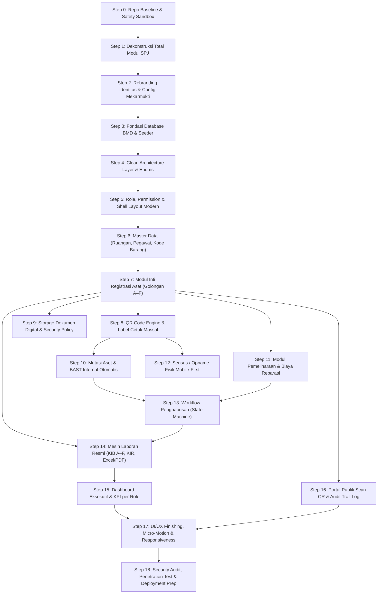

---

### 23.3 Matriks Ringkasan Tahapan (WBS Overview)

| Step | Kode | Nama Tahapan | Estimasi Kompleksitas | Ketergantungan | Output Kunci |
|---|---|---|---|---|---|
| **0** | `PREP` | Baseline & Safety Sandbox | Rendah (1/5) | - | Git branch bersih, backup DB & config |
| **1** | `PURGE` | Dekonstruksi Modul SPJ & Cleanup | Sedang (3/5) | Step 0 | 17+ file SPJ dihapus, route bersih, build sukses |
| **2** | `BRAND` | Rebranding Identitas Mekarmukti | Rendah (2/5) | Step 1 | Nama sistem baru di `.env`, config, header, footer |
| **3** | `SCHEMA` | Fondasi Database & Migrasi BMD | Tinggi (4/5) | Step 2 | 14 tabel baru, relasi atomik, seeder master |
| **4** | `ARCH` | Clean Architecture & Enums | Sedang (3/5) | Step 3 | Enums PHP 8.2+, Repositories, Services dasar |
| **5** | `AUTH` | Role & Permission + Shell UI | Sedang (3/5) | Step 4 | Spatie middleware, 4 role aktif, sidebar dinamis |
| **6** | `MASTER` | Master Data (Ruangan, Pegawai, Kode) | Sedang (3/5) | Step 5 | CRUD Ruangan, Pegawai, Kodefikasi 108 + SearchSelect |
| **7** | `CORE` | Inventarisasi Aset (Golongan A–F) | Sangat Tinggi (5/5) | Step 6 | Registrasi multi-golongan, nomor register unik |
| **8** | `QR` | QR Code Engine & Label Print | Sedang (3/5) | Step 7 | Token QR acak, preview cetak A4 12 label |
| **9** | `MEDIA` | Dokumen & Foto Aset Aman | Sedang (3/5) | Step 7 | Disk private, Policy guard, lightbox foto |
| **10** | `MUTASI` | Mutasi Aset & BAST Internal | Tinggi (4/5) | Step 7, 8 | Form mutasi, update ruangan/PJ, cetak BAST PDF |
| **11** | `RAWAT` | Pemeliharaan & Monitoring Biaya | Sedang (3/5) | Step 7 | Pencatatan servis, nota, update kondisi aset |
| **12** | `OPNAME` | Sensus / Opname Fisik Mobile | Tinggi (4/5) | Step 7, 8 | Mobile scanner camera, quick-tap kondisi, progress bar |
| **13** | `HAPUS` | Usulan Penghapusan (State Machine) | Sangat Tinggi (5/5) | Step 7, 10, 11 | Flow draft → sekcam → camat, freeze aset |
| **14** | `REPORT` | Mesin Laporan Resmi KIB & KIR | Sangat Tinggi (5/5) | Step 7, 13 | Export KIB A–F, KIR, Rekap (PDF & Excel) |
| **15** | `DASH` | Dashboard Eksekutif per Role | Sedang (3/5) | Step 14 | 4 varian dashboard (Camat, Sekcam, PB, Staf) |
| **16** | `AUDIT` | Public QR Scan & Activity Log | Rendah (2/5) | Step 7 | `GET /scan/{token}` publik, viewer riwayat aktivitas |
| **17** | `POLISH` | UI/UX Finishing & Responsiveness | Sedang (3/5) | Step 15, 16 | Glassmorphism, framer-motion, mobile drawer |
| **18** | `PROD` | Security Audit & Deploy Prep | Tinggi (4/5) | Step 17 | IDOR check, SQLite WAL, backup cron, zero warning |

---

### 23.4 Detail Pelaksanaan Rinci per Langkah (Step-by-Step)

#### 🔹 STEP 0: Safety Baseline & Sandbox Preparation
- **Tujuan**: Menjamin bahwa seluruh eksperimen dan rombakan memiliki titik kembali (*rollback point*) yang aman tanpa risiko kehilangan histori kerja sebelumnya.
- **Prasyarat**: Status repositori bersih (`git status` clean).
- **Action Items**:
  1. Buat branch git baru khusus rombak v3: `git checkout -b refactor/overhaul-bmd-v3`.
  2. Backup database SQLite saat ini: salin `database/database.sqlite` ke `database/database.sqlite.bak_v2`.
  3. Backup `.env` saat ini ke `.env.backup_v2`.
- **Verifikasi**: Jalankan `git branch` (memastikan berada di branch baru) dan pastikan file backup tersedia.
- **Risiko**: Rendah.

---

#### 🔹 STEP 1: Dekonstruksi Total Modul SPJ & Dead Code Purge
- **Tujuan**: Membersihkan 100% jejak modul SPJ, arsip belanja, verifikasi keuangan, dan dependency yang tidak lagi relevan.
- **Prasyarat**: Step 0 selesai.
- **Action Items**:
  1. Hapus file Backend SPJ sesuai Bagian 13.1:
     - `app/Http/Controllers/SpjSubmissionController.php`
     - `app/Http/Controllers/VerifikasiSpjController.php`
     - `app/Http/Requests/StoreSpjRequest.php`
     - `app/Http/Requests/UpdateSpjRequest.php`
     - `app/Http/Requests/VerifikasiSpjRequest.php`
     - `app/Services/SpjService.php`
     - `app/Listeners/SendSpjNotification.php`
     - `app/Enums/SpjStatus.php`
  2. Hapus file Frontend SPJ sesuai Bagian 13.2:
     - `resources/js/Pages/Spj/` (seluruh folder beserta isinya: `Index.jsx`, `Create.jsx`, `Edit.jsx`, `Show.jsx`, `Verifikasi.jsx`)
  3. Bersihkan `routes/web.php`:
     - Hapus semua route group `/spj` dan `/verifikasi-spj`.
     - Hapus import class controller SPJ yang tidak lagi dipakai.
  4. Perbaiki Utang Teknis TD-03 & TD-04:
     - Hapus `app/Services/ExportService.php` lama jika hanya berisi export SPJ.
     - Perbaiki namespace atau referensi class yang terputus.
  5. Bersihkan Navigation Menu (`resources/js/Layouts/AppLayout.jsx` / `Sidebar.jsx`):
     - Buang item menu "Pengajuan SPJ" dan "Verifikasi SPJ".
- **Verifikasi**:
  - `php artisan route:list` (tidak ada lagi error route missing controller).
  - `npm run build` (tidak ada broken import di React).
  - `git grep -i "SpjSubmission"` (tidak ada sisa panggilan di kode aktif).
- **Risiko**: Broken imports pada menu layout jika ada komponen yang masih meng-import halaman SPJ. Mitigasi: periksa referensi navigasi.

---

#### 🔹 STEP 2: Rebranding Identitas Sistem & Konfigurasi Mekarmukti
- **Tujuan**: Menghilangkan seluruh identitas "SIMPEL KAN" dan "Kecamatan Caringin", menggantinya dengan nama sistem BMD baru dan "Kecamatan Mekarmukti".
- **Prasyarat**: Step 1 selesai.
- **Action Items**:
  1. Update `.env.example` dan `.env`:
     - `APP_NAME="SIMUKTI - Sistem Informasi Manajemen Aset Mekarmukti"` (atau nama pilihan dari Bab 2).
  2. Update `config/app.php`: default name disesuaikan.
  3. Update Branding Frontend:
     - Ganti judul di `resources/js/app.jsx` (`title` callback).
     - Ganti Logo SVG dan teks header di `AppLayout.jsx` & `GuestLayout.jsx`.
     - Ganti Favicon dengan lambang/ikon BMD modern.
     - Ganti nama instansi di footer: "Pemerintah Kecamatan Mekarmukti, Kabupaten Garut".
  4. Bersihkan kata kunci "Caringin" di seluruh teks template surat/halaman.
- **Verifikasi**:
  - `npm run build` berhasil.
  - Buka halaman login di browser: Header, tab browser title, dan footer menampilkan identitas Mekarmukti.
- **Risiko**: Teks hardcoded terselip di beberapa view. Mitigasi: lakukan `git grep -i "caringin"` dan `git grep -i "simpel kan"`.

---

#### 🔹 STEP 3: Fondasi Database BMD — Migrasi, Constraint & Seeder
- **Tujuan**: Membangun skema data BMD v3 yang solid, ternormalisasi, dan memenuhi kaidah Permendagri 108/2016.
- **Prasyarat**: Step 2 selesai.
- **Action Items**:
  1. Hapus migrasi lama tabel SPJ:
     - Hapus migrasi `create_spj_submissions_table` dan tabel berkas belanja lama.
  2. Pasang & Konfigurasi Spatie Laravel Permission:
     - Jalankan publish migrasi Spatie (`roles`, `permissions`, `model_has_roles`, dll).
  3. Buat file migrasi baru secara berurutan (sesuai Bab 15.3):
     - `0001_create_pengaturan_aplikasi_table.php`
     - `0002_create_pegawai_table.php`
     - `0003_create_ref_kode_barang_table.php` (indeks `kode`, `level`, `nama`)
     - `0004_create_ruangan_table.php` (indeks `kode_ruangan`)
     - `0005_create_nomor_urut_table.php` (counter atomic lock)
     - `0006_create_aset_table.php` (tabel induk Aset BMD)
     - `0007_create_aset_detail_subtables.php` (`aset_detail_tanah` s/d `aset_detail_kdp`)
     - `0008_create_aset_dokumen_table.php` (media, foto & surat kepemilikan)
     - `0009_create_mutasi_aset_table.php` (mutasi internal & BAST)
     - `0010_create_pemeliharaan_table.php` (servis, reparasi, suku cadang)
     - `0011_create_inventarisasi_table.php` (`inventarisasi` & `inventarisasi_item`)
     - `0012_create_usulan_penghapusan_table.php` (`usulan_penghapusan` & item)
     - `0013_create_riwayat_aset_table.php` (audit trail per aset)
  4. Buat Seeder Awal:
     - `RolePermissionSeeder` (4 role + matriks izin Bab 7.3).
     - `UserSeeder` (akun per role: Camat, Sekcam, Pengurus Barang, Staf).
     - `RuanganSeeder` (8 ruangan utama Kantor Kecamatan Mekarmukti).
     - `PegawaiSeeder` (pejabat dan staf kecamatan).
     - `KodeBarangSeeder` (subset kode barang KIB A–F).
  5. Eksekusi database fresh: `php artisan migrate:fresh --seed`.
- **Verifikasi**:
  - `php artisan migrate:status` (semua tabel up).
  - Cek database: 14 tabel baru terisi seeder dan foreign key aktif.
- **Risiko**: Foreign key constraint error jika urutan migrasi keliru. Mitigasi: patuhi urutan tabel induk terlebih dahulu sebelum tabel anak.

---

#### 🔹 STEP 4: Clean Architecture Layer & Enums/Constants
- **Tujuan**: Menyiapkan pondasi arsitektur kode standar Jarvis Pro: **Controller → Service → Repository → Model**.
- **Prasyarat**: Step 3 selesai.
- **Action Items**:
  1. Buat Enums PHP 8.2 (`app/Enums/`):
     - `GolonganAset.php` (A, B, C, D, E, F)
     - `KondisiAset.php` (BAIK, RUSAK_RINGAN, RUSAK_BERAT)
     - `StatusAset.php` (TERCATAT, DIUSULKAN_HAPUS, DIHAPUSKAN, HILANG)
     - `StatusPenghapusan.php` (DRAFT, MENUNGGU_VERIFIKASI_SEKCAM, DISETUJUI_CAMAT, DITOLAK, SELESAI_SK)
     - `JenisMutasi.php` (PINDAH_RUANGAN, PINDAH_PENANGGUNG_JAWAB, KOMBINASI)
     - `JenisDokumenAset.php` (SERTIFIKAT, BPKB, STNK, FAKTUR, FOTO_FISIK, BAST)
  2. Buat Model Eloquent dengan Strict Types & Casting:
     - `Aset`, `Pegawai`, `Ruangan`, `RefKodeBarang`, `MutasiAset`, `Pemeliharaan`, `Inventarisasi`, `UsulanPenghapusan`, dll.
     - Definisikan relasi `hasMany`, `belongsTo`, serta local scope (`scopeAktif`, `scopePerluPerhatian`).
  3. Buat Generator Layanan Atomik (`app/Services/`):
     - `NomorRegistrasiGeneratorService.php` (atomik DB lock counter, bebas race-condition).
     - `NomorBastGeneratorService.php`
     - `RiwayatAsetService.php` (logger event aset otomatis).
  4. Siapkan Repository Interface & Eloquent Implementation (`app/Repositories/`).
- **Verifikasi**: Buat unit test sederhana `php artisan test --filter=NomorRegistrasiTest` untuk memastikan counter berurutan tanpa duplikat saat loop 10x.
- **Risiko**: Race condition pada nomor registrasi. Mitigasi: gunakan transaksi database `DB::transaction()` dengan `lockForUpdate()` pada tabel `nomor_urut`.

---

#### 🔹 STEP 5: Otentikasi, Role Spatie & Layout Shell Modern
- **Tujuan**: Mengamankan endpoint aplikasi berdasarkan matriks wewenang dan menyediakan antarmuka pengguna dasar yang modular dan responsif.
- **Prasyarat**: Step 4 selesai.
- **Action Items**:
  1. Konfigurasi Middleware Spatie di `bootstrap/app.php` atau kernel: `role`, `permission`.
  2. Perbarui `HandleInertiaRequests.php`: bagikan data user login, daftar role, dan daftar permission ke frontend React (`auth.user`, `auth.permissions`).
  3. Rombak `Sidebar.jsx` & `Navbar.jsx`:
     - Render menu berdasarkan role user aktif (Camat tidak melihat menu input barang, Staf tidak melihat menu approval).
     - Tambahkan badge penanda antrean verifikasi (misal: "3 usulan pending").
  4. Setup Komponen Atom UI Dasar (`resources/js/Components/`):
     - `<StatCard />`, `<StatusBadge />`, `<KondisiBadge />`, `<GolonganBadge />`, `<ConfirmModal />`, `<LoadingSkeleton />`.
  5. Konfigurasi Toast Provider (`Sonner`) dengan styling modern.
- **Verifikasi**: Login dengan masing-masing dari 4 akun pengguna (Camat, Sekcam, Pengurus Barang, Staf), pastikan item sidebar yang tampil tepat sesuai wewenang.
- **Risiko**: Menu tampil tapi route di-bypass via URL. Mitigasi: proteksi ganda (frontend conditional rendering + backend route middleware).

---

#### 🔹 STEP 6: Master Data Management (Ruangan, Pegawai, Kode Barang)
- **Tujuan**: Menyediakan antarmuka pengelolaan data referensi yang dibutuhkan sebelum pendaftaran aset dapat dilakukan.
- **Prasyarat**: Step 5 selesai.
- **Action Items**:
  1. Modul Ruangan:
     - Controller: `RuanganController.php` (CRUD).
     - FormRequest: `StoreRuanganRequest.php`, `UpdateRuanganRequest.php`.
     - Frontend: `Pages/Master/Ruangan/Index.jsx` + Modal Tambah/Edit.
  2. Modul Pegawai:
     - Controller: `PegawaiController.php` (CRUD, NIP unik, jabatan, kontak).
     - Frontend: `Pages/Master/Pegawai/Index.jsx` + Modal Tambah/Edit.
  3. Modul Kodefikasi Barang (Permendagri 108):
     - Controller: `KodeBarangController.php` (Read & Search API autocomplete).
     - Komponen Reusable: `<SearchSelect />` dengan pencarian debounce ke API `/api/master/kode-barang`.
- **Verifikasi**:
  - Tambah ruangan baru "Ruang IT Mekarmukti" via form -> tersimpan dan muncul di tabel.
  - Tambah pegawai baru -> tersimpan.
  - Cari kode barang di dropdown -> autocomplete berfungsi lancar.
- **Risiko**: Data kode barang ribuan entri menyebabkan dropdown freeze. Mitigasi: wajib server-side search dengan pagination/limit 20.

---

#### 🔹 STEP 7: Modul Inti Registrasi & Inventaris Aset (Golongan A–F)
- **Tujuan**: Fitur utama sistem untuk mendaftarkan dan melihat seluruh aset milik daerah dengan spesifikasi teknis sesuai golongannya.
- **Prasyarat**: Step 6 selesai.
- **Action Items**:
  1. Backend Aset:
     - `AsetController.php`: `index`, `create`, `store`, `show`, `edit`, `update`, `destroy`.
     - FormRequest: `StoreAsetRequest.php` (validasi kondisional per golongan: jika golongan A wajib ada luas/status tanah, jika B wajib ada nomor polisi/rangka/mesin).
     - `AsetService.php`: orkestrasi simpan tabel induk `aset` + tabel detail spesifik + catat ke `riwayat_aset`.
  2. Frontend Registrasi:
     - `Pages/Aset/Create.jsx`: Form multi-tab/dinamis dengan selector golongan A–F.
     - Form spesifikasi teknis dinamis yang merender field sesuai golongan yang dipilih.
  3. Frontend Daftar Aset:
     - `Pages/Aset/Index.jsx`: Tabel data modern, tombol toggle View Mode (Tabel / Card Grid).
     - Filter bar: Golongan (A–F), Kondisi (Baik, RR, RB), Ruangan, Tahun Perolehan.
     - Fitur Bulk Selection (checkbox) untuk persiapan cetak label QR.
- **Verifikasi**:
  - Daftarkan 1 aset Golongan A (Tanah) dan 1 aset Golongan B (Kendaraan Operasional).
  - Nomor register terisi otomatis tanpa konflik.
  - Data detail tersimpan di tabel subdetail masing-masing.
- **Risiko**: Kompleksitas validasi dinamis. Mitigasi: pisahkan FormRequest per subgolongan atau gunakan method `rules()` berbasis switch-case golongan.

---

#### 🔹 STEP 8: QR Code Engine & Label Cetak Massal
- **Tujuan**: Otomatisasi pembuatan QR Code unik untuk setiap aset dan antarmuka cetak label fisik stiker siap tempel.
- **Prasyarat**: Step 7 selesai.
- **Action Items**:
  1. Backend QR Engine:
     - Generator token acak unik (UUID v4 / string kriptografis 16 karakter).
     - URL QR: mengarah ke `https://domain.go.id/scan/{token}`.
     - Endpoint API download QR SVG/PNG.
  2. Cetak Label Massal:
     - `LabelCetakController.php`: menerima array ID aset dari request.
     - View Blade `templates/print/label-qr-a4.blade.php`: format grid A4 (3 kolom x 4 baris = 12 stiker per lembar) dengan batas potong presisi.
  3. Frontend Preview:
     - Modal `<QrLabelPreview />` sebelum cetak agar pengguna bisa memilih template ukuran label.
- **Verifikasi**:
  - Pilih 5 aset di daftar -> klik "Cetak Label QR" -> halaman print view terbuka dengan format rapi dan QR terbaca saat discan smartphone.
- **Risiko**: Layout cetak bergeser di browser berbeda. Mitigasi: gunakan CSS `@media print` dengan satuan ukuran fisik milimeter (`mm`) dan `box-sizing: border-box`.

---

#### 🔹 STEP 9: Manajemen Berkas & Dokumen Legalitas (Security Storage)
- **Tujuan**: Pengelolaan arsip digital (foto fisik aset, sertifikat tanah, BPKB, faktur) dengan proteksi akses ketat.
- **Prasyarat**: Step 7 selesai.
- **Action Items**:
  1. Storage Configuration:
     - Disk `public`: untuk foto fisik aset (thumbnail & galeri).
     - Disk `private` (`local` terenkripsi): untuk dokumen legal (sertifikat, BPKB, STNK).
  2. Backend Media & Security:
     - `AsetDokumenController.php`: upload & delete.
     - Secure Download Controller: `GET /aset/{id}/dokumen/{dokumenId}/download` dengan validasi Policy (`AsetPolicy::viewDocuments`).
     - Validasi file: MIME type ketat (hanya PDF, JPG, PNG), max size 5MB.
  3. Frontend Detail Aset (`Pages/Aset/Show.jsx`):
     - Tab Dokumen: Daftar surat kepemilikan dengan badge legalitas dan tombol unduh aman.
     - Tab Foto: Galeri visual interaktif dengan lightbox viewer (`yet-another-react-lightbox`).
- **Verifikasi**:
  - Upload foto dan dokumen sertifikat pada aset.
  - Coba akses URL file private langsung via browser tanpa login -> wajib mendapatkan error `403 Forbidden` atau redirect login.
- **Risiko**: Akses dokumen rahasia tanpa izin (IDOR). Mitigasi: wajib authorization policy di Controller sebelum streaming file response.

---

#### 🔹 STEP 10: Transaksi BMD — Mutasi Aset & BAST Internal Otomatis
- **Tujuan**: Mengelola perpindahan fisik dan tanggung jawab aset antar ruangan/pegawai disertai Berita Acara Serah Terima (BAST).
- **Prasyarat**: Step 7, Step 8 selesai.
- **Action Items**:
  1. Backend Mutasi:
     - `MutasiAsetController.php`: form mutasi & submit.
     - `MutasiAsetService.php`: update field `ruangan_id` dan `pegawai_id` pada tabel `aset`, catat ke `mutasi_aset`, catat ke `riwayat_aset`.
     - Generator nomor urut BAST: format `NOMOR/BAST-BMD/KEC-MKM/{ROMAN}/{TAHUN}`.
  2. BAST Print Engine:
     - Template Blade `templates/print/bast-mutasi.blade.php`: format resmi kedinasan lengkap dengan NIP dan tanda tangan kedua belah pihak.
  3. Frontend Mutasi:
     - Modal/Halaman Mutasi Aset: pemilihan ruangan baru dan pemegang baru.
     - Riwayat mutasi tercatat rapi di halaman detail aset terkait.
- **Verifikasi**:
  - Lakukan mutasi Laptop dari "Subbag Umum" ke "Seksi Trantib".
  - Lokasi aset di halaman index berubah menjadi "Seksi Trantib".
  - BAST tercetak dalam format PDF resmi dengan nomor BAST berurutan.
- **Risiko**: Mutasi tercatat tetapi lokasi aset di tabel induk gagal terupdate. Mitigasi: wajib dibungkus dalam `DB::transaction()`.

---

#### 🔹 STEP 11: Transaksi BMD — Pemeliharaan & Monitoring Biaya Servis
- **Tujuan**: Mencatat riwayat servis berkala, perbaikan kerusakan, biaya yang dikeluarkan, dan update status kondisi fisik barang.
- **Prasyarat**: Step 7 selesai.
- **Action Items**:
  1. Backend Pemeliharaan:
     - `PemeliharaanController.php` (CRUD pemeliharaan per aset).
     - FormRequest: `StorePemeliharaanRequest.php` (biaya, tanggal, bengkel/vendor, uraian, bukti nota, kondisi setelah diservis).
     - Logic: otomatis perbarui kondisi aset (misal: dari "Rusak Ringan" menjadi "Baik" pasca servis).
  2. Frontend Pemeliharaan:
     - Tab "Pemeliharaan & Servis" pada detail aset.
     - Halaman Rekap Pemeliharaan Kecamatan: total anggaran pemeliharaan yang telah terserap tahun berjalan.
- **Verifikasi**:
  - Catat servis kendaraan bermotor -> kondisi aset berubah jadi "Baik", riwayat pengeluaran bertambah.
- **Risiko**: Nilai rupiah format desimal tidak sinkron. Mitigasi: simpan dalam tipe integer (satuan rupiah murni) di DB, format ke Rupiah (`Intl.NumberFormat`) di frontend.

---

#### 🔹 STEP 12: Transaksi BMD — Sensus / Opname Fisik Mobile-First
- **Tujuan**: Memfasilitasi kegiatan inventarisasi fisik tahunan di lapangan menggunakan smartphone tanpa perlu bawa laptop atau berkas kertas.
- **Prasyarat**: Step 7, Step 8 selesai.
- **Action Items**:
  1. Backend Sensus:
     - `InventarisasiController.php`: buat sesi sensus (misal: "Sensus BMD 2026"), lock ruangan/daftar aset, simpan hasil per item.
     - Perhitungan persentase progres sensus real-time (`ditemukan / total_aset * 100%`).
  2. Frontend Lapangan (Mobile-First):
     - `Pages/Inventarisasi/SensusLapangan.jsx`: tampilan khusus layar HP.
     - Integrasi kamera barcode scanner: scan label stiker -> langsung muncul detail aset.
     - Quick Action Button: tombol satu sentuhan untuk konfirmasi kondisi: [✅ BAIK] [🟡 RUSAK RINGAN] [🔴 RUSAK BERAT].
     - Input catatan cepat (misal: "Unit di meja staf pelayanan").
- **Verifikasi**:
  - Buka halaman sensus via HP/Chrome mobile mode -> scan QR -> konfirmasi kondisi -> item langsung tercentang hijau dan progress bar naik.
- **Risiko**: Koneksi internet seluler di pelosok kecamatan putus-nyambung. Mitigasi: berikan feedback visual saat data sedang disimpan, cegah duplikasi klik.

---

#### 🔹 STEP 13: Workflow Approval Usulan Penghapusan (State Machine)
- **Tujuan**: Mekanisme penghapusan aset rusak berat/hilang dengan rantai persetujuan berjenjang: Pengurus Barang → Sekcam → Camat.
- **Prasyarat**: Step 7, Step 10, Step 11 selesai.
- **Action Items**:
  1. Backend State Machine:
     - `UsulanPenghapusanController.php` & `VerifikasiPenghapusanController.php`.
     - Validasi transisi status ketat (hanya DRAFT yang bisa diajukan, hanya MENUNGGU yang bisa diverifikasi Sekcam, hanya VERIFIED yang bisa disetujui Camat).
     - Saat aset dimasukkan dalam usulan penghapusan, status aset berubah menjadi `DIUSULKAN_HAPUS` (terkunci dari mutasi).
     - Catatan penolakan wajib diisi jika Sekcam/Camat menolak usulan.
  2. Frontend Approval Workflow:
     - Halaman Pengajuan (Pengurus Barang): pilih aset kondisi "Rusak Berat", upload foto bukti kerusakan, tulis alasan.
     - Antrean Verifikasi Sekcam: daftar periksa fisik, tombol "Teruskan ke Camat" atau "Kembalikan Revisi".
     - Antrean Persetujuan Camat: ringkasan eksekutif nilai aset yang akan dihapus, tombol "Setujui Penghapusan".
- **Verifikasi**:
  - Coba bypass: login sebagai Staf lalu kirim request approve via Postman/curl -> wajib mendapat response `403 Unauthorized`.
  - Flow normal berjalan lancar dari pengajuan hingga persetujuan Camat.
- **Risiko**: Aset yang sedang diusulkan terhapus tidak sengaja dimutasi. Mitigasi: database rule / policy yang melarang mutasi jika `status_aset !== TERCATAT`.

---

#### 🔹 STEP 14: Mesin Pembuatan Laporan Resmi (KIB A–F, KIR & Rekapitulasi)
- **Tujuan**: Menghasilkan dokumen cetak resmi kedinasan sesuai regulasi Permendagri 108/2016 yang siap diserahkan ke BPKAD Kabupaten Garut.
- **Prasyarat**: Step 7, Step 13 selesai.
- **Action Items**:
  1. Service Ekspor:
     - `LaporanBmdService.php`: query builder teroptimasi dengan eager loading untuk mencegah masalah N+1.
     - Export Excel: Menggunakan `maatwebsite/excel` dengan format tabel bergaris resmi, header bertingkat, dan format rupiah.
     - Export PDF: Format kertas landscape legal/F4, kop surat kecamatan, dan kolom tanda tangan Camat & Pengurus Barang.
  2. Implementasi Jenis Laporan (sesuai Bab 12):
     - LAP-01 s/d LAP-06: KIB A (Tanah), KIB B (Peralatan & Mesin), KIB C (Gedung & Bangunan), KIB D (Jalan/Jaringan), KIB E (Aset Tetap Lainnya), KIB F (KDP).
     - LAP-07: Kartu Inventaris Ruangan (KIR) per Ruangan.
     - LAP-08: Buku Inventaris (Rekap Seluruh Aset).
     - LAP-09: Daftar Usulan Penghapusan Barang.
  3. Frontend Laporan Interaktif:
     - `Pages/Laporan/Index.jsx`: Kartu pilihan laporan, filter fleksibel (tahun, ruangan, kondisi), tombol "Preview di Layar" dan "Unduh Excel / PDF".
- **Verifikasi**:
  - Unduh KIB B dalam format Excel -> buka file: kolom kode barang, nama spesifikasi, tahun pembelian, harga, dan tanda tangan lengkap rapi.
  - Unduh KIR Ruangan Camat dalam format PDF -> format pas satu halaman landscape.
- **Risiko**: Memory limit PHP habis saat mengekspor ratusan data aset ke PDF. Mitigasi: gunakan `chunk()` atau query cursor dan optimasi memori.

---

#### 🔹 STEP 15: Dashboard Eksekutif & Ringkasan Analitik per Role
- **Tujuan**: Memberikan ringkasan informasi visual yang relevan, cepat, dan bernilai tinggi bagi pimpinan dan pelaksana.
- **Prasyarat**: Step 14 selesai.
- **Action Items**:
  1. Backend Dashboard Data Provider:
     - `DashboardController.php`: agregasi query yang di-cache singkat untuk performa kilat.
  2. Variasi Tampilan Berdasarkan Role:
     - **Dashboard Camat**: Total valuasi nilai aset kecamatan (Rp), komposisi aset per golongan, alert barang rusak butuh perhatian, shortcut persetujuan.
     - **Dashboard Sekcam**: Jumlah usulan penghapusan pending verifikasi, rekapitulasi mutasi internal bulan ini.
     - **Dashboard Pengurus Barang**: Jumlah total unit aset, jadwal servis mendatang, shortcut cepat: [+ Tambah Aset], [🖨️ Cetak Label], [📱 Mulai Sensus].
     - **Dashboard Staf**: Daftar aset yang menjadi tanggung jawab ruangan tempat staf bertugas.
  3. Visualisasi Ringan & Modern:
     - Progress bar kondisi aset (Baik: Hijau, RR: Kuning, RB: Merah).
     - Glass card design dengan tipografi Inter angka besar yang elegan.
- **Verifikasi**:
  - Angka pada kartu dashboard sama persis dengan hasil query database aktual (`COUNT(*)` dan `SUM(nilai_perolehan)`).
- **Risiko**: Query `SUM` dan `COUNT` lambat jika data membesar. Mitigasi: tambahkan composite index pada tabel `aset` (`(kondisi, status)`).

---

#### 🔹 STEP 16: Portal Publik Scan QR & Audit Trail (Activity Log)
- **Tujuan**: Transparansi publik terbatas saat stiker QR discan oleh pihak umum dan pencatatan riwayat setiap perubahan data untuk akuntabilitas.
- **Prasyarat**: Step 7 selesai.
- **Action Items**:
  1. Halaman Scan Publik:
     - Route tanpa auth: `GET /scan/{token}`.
     - Controller: `PublicScanController.php`.
     - Frontend Publik: `Pages/Public/AsetScanInfo.jsx` (tampilan bersih, responsif HP, hanya menampilkan info umum: Nama barang, Kode barang, Ruangan, Tahun perolehan, Kondisi. Dokumen rahasia disembunyikan).
  2. Modul Audit Trail (Activity Log):
     - Event listener / model observer yang mencatat aktivitas (`created`, `updated`, `deleted`, `mutated`).
     - Halaman Activity Log untuk Super Admin & Camat: siapa yang merubah apa dan kapan.
- **Verifikasi**:
  - Scan QR tanpa login di browser private (incognito) -> info publik muncul tanpa meminta login.
  - Cek tabel log aktivitas -> aksi tercatat lengkap beserta IP address dan user agent.
- **Risiko**: Kebocoran data harga rahasia di halaman publik. Mitigasi: filter field response dengan ketat (whitelist atribut publik).

---

#### 🔹 STEP 17: UI/UX Finishing, Micro-Interactions & Responsiveness
- **Tujuan**: Memastikan aplikasi memiliki visual kelas dunia (*The Stark Touch*), sangat cepat, ramah layar sentuh, dan tidak kaku.
- **Prasyarat**: Step 15, Step 16 selesai.
- **Action Items**:
  1. Penerapan Brand Design System:
     - Terapkan palet warna utama Emerald/Teal (`hsl 162°`) konsisten di seluruh tombol, badge, dan highlight link.
  2. Responsiveness Audit:
     - Konversi otomatis tabel data menjadi kartu ringkas (*Table-to-Card*) pada layar di bawah 768px (HP).
     - Touch target minimal 44x44px pada seluruh tombol di mobile.
  3. Micro-Animations & Feedback:
     - Transisi halus fade-in saat ganti halaman.
     - Animasi count-up pada angka besar dashboard.
     - Skeleton pulse saat data sedang dimuat (tidak ada layar putih kosong).
  4. Aksesibilitas:
     - Dukungan keyboard navigation penuh (Tab, Enter, Escape).
     - Label ARIA pada tombol yang hanya berupa ikon.
- **Verifikasi**:
  - Tes tampilan di resolusi Desktop (1920px), Tablet (768px), dan HP (375px) -> tidak ada teks terpotong (*overflow*) atau horizontal scrolling liar.
- **Risiko**: Animasi berlebihan memperlambat performa HP murah. Mitigasi: gunakan properti CSS GPU-accelerated (`transform`, `opacity`) dan batasi durasi maksimal 200–300ms.

---

#### 🔹 STEP 18: Security Hardening, Penetration Testing & Production Ready Check
- **Tujuan**: Memastikan sistem 100% aman, tahan serangan, bebas celah keamanan, dan siap dideploy ke server produksi.
- **Prasyarat**: Seluruh Step 0 s/d Step 17 selesai.
- **Action Items**:
  1. Security Audit Mandiri (Jarvis Protocol):
     - Uji coba serangan SQL Injection pada seluruh input form dan parameter filter.
     - Uji coba XSS pada field nama aset, merk, dan catatan.
     - Uji coba IDOR pada download berkas dan update aset.
     - Uji coba upload file dengan ekstensi ganda (misal: `shell.php.jpg`).
  2. Optimasi Database & Storage:
     - Aktifkan mode WAL (Write-Ahead Logging) pada SQLite produksi.
     - Konfigurasi script cron backup otomatis harian: database dan folder storage dokumen.
  3. Production Build & Linting:
     - Jalankan `npm run build` (pastikan 0 error, 0 warning, bundle size teroptimasi).
     - Jalankan `composer install --no-dev --optimize-autoloader`.
     - Jalankan `php artisan test` (seluruh test suite hijau 100%).
  4. Dokumentasi & Serah Terima:
     - Catat hasil implementasi di `.agent/PROJECT_LOG.md` dan perbarui `.agent/STRUCTURE.md`.
     - Siapkan ringkasan manual penggunaan singkat untuk staf Kecamatan Mekarmukti.
- **Verifikasi**:
  - `php artisan test` lulus 100%.
  - Aplikasi siap untuk dipresentasikan dan dideploy ke server.
- **Risiko**: Database terkunci (*busy*) jika traffic tinggi pada SQLite. Mitigasi: WAL mode aktif dengan `busy_timeout = 5000ms`.

---

*Catatan Eksekusi*: Setiap kali Mr Zeps memberikan instruksi untuk mengeksekusi tahapan tertentu, sebutkan kode step (misal: `Step 0` atau `Step 1`) agar proses pengerjaan selalu terkoordinasi dan terkontrol dengan presisi tinggi.

---

*Dokumen ini adalah satu-satunya sumber acuan rombak sistem v3. Seluruh catatan pengembangan & deploy lama telah dihapus atas instruksi Mr Zeps (6 Okt 2026). Bagian 20–22 ditambahkan pada 6 Okt 2026 sebagai rekomendasi alur sistem, fitur wajib, dan panduan UI/UX modern. Bagian 23 ditambahkan sebagai panduan urutan pengerjaan step-by-step lengkap.*
